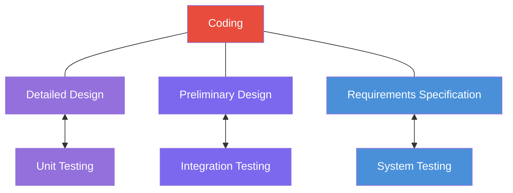

# 🗺️ Introduction to Software Testing — Map of Content

> **Course:** Introduction to Software Testing  
> **Instructor:** Hossein Hassani  
> **Semester:** Spring 2026  
> **Textbook:** Jorgensen, P. C. (2014). *Software Testing and Analysis: A Craftsman's Approach.* CRC Press.

---

## 📚 Unit Testing (Specification-Based)

| Lecture | Topic | Chapter |
|---------|-------|---------|
| [[Lecture 01 - Introduction to Software Testing]] | Why testing matters, software failures, module overview | Ch. 1 |
| [[Lecture 02 - Basic Concepts and Terminology]] | Error/Fault/Failure, Test Cases, S-P-T model, Fault Taxonomies | Ch. 1 |
| [[Lecture 03 - Boundary Value Testing]] | Units, BVT types, Triangle Problem, $4n+1$ formula | Ch. 2, 5 |
| [[Lecture 04 - BVT Examples and Robustness]] | Robust/Worst-case BVT, NextDate, Commission Problem | Ch. 5 |
| [[Lecture 05 - BVT Limitations and Special Value Testing]] | BVA limits, Single-fault assumption, Special Value Testing | Ch. 5 |
| [[Lecture 06 - Random Testing and BVT Guidelines]] | Random testing, BVT guidelines, Syntactic vs Semantic | Ch. 5 |

## 📚 Unit Testing (Equivalence & Decision Tables)

| Lecture | Topic | Chapter |
|---------|-------|---------|
| [[Lecture 07 - Equivalence Class Testing]] | ECT types (Weak/Strong × Normal/Robust), partitions | Ch. 6 |
| [[Lecture 08 - ECT Examples and Edge Testing]] | Triangle/NextDate/Commission ECT, Edge Testing, Guidelines | Ch. 5, 6 |
| [[Lecture 09 - Decision Table Testing]] | Decision tables, rules, don't care, LEDT/EEDT | Ch. 7 |
| [[Lecture 10 - Decision Tables Continued]] | NextDate DT (3 tries), Cause-and-Effect Graphing | Ch. 7 |

## 📚 Unit Testing (Code-Based / Structural)

| Lecture | Topic | Chapter |
|---------|-------|---------|
| [[Lecture 11 - Path Testing and DD-Paths]] | Program graphs, DD-paths, Coverage metrics (C0–C∞) | Ch. 8 |
| [[Lecture 12 - Basis Path Testing and Cyclomatic Complexity]] | McCabe's method, $V(G)=e-n+p$, Essential complexity | Ch. 8 |
| [[Lecture 13 - Data Flow Testing]] | DEF/USE, du-paths, Rapps-Weyuker metrics, Program Slicing | Ch. 9 |

## 📚 Integration Testing

| Lecture | Topic | Chapter |
|---------|-------|---------|
| [[Lecture 14 - Integration Testing]] | Top-down, Bottom-up, Sandwich, Big Bang | Ch. 13 |
| [[Lecture 15 - Call Graph and Path-Based Integration]] | Pairwise, Neighborhood, MM-paths, Message quiescence | Ch. 13 |

## 📚 System Testing

| Lecture | Topic | Chapter |
|---------|-------|---------|
| [[Lecture 16 - System Testing]] | Threads, ASFs, SATM, Nonfunctional testing, Stress testing | Ch. 14 |

---

## 🔑 Key Concepts Index

### Core Terminology
- [[Test Case]] — Precondition + Input + Expected Output
- [[Error]] → [[Fault]] → [[Failure]] → [[Incident]]

### Specification-Based (Black-Box) Techniques
- [[Boundary Value Testing]] — Min, Min+, Nom, Max-, Max
- [[Equivalence Class Testing]] — Partitions for completeness + non-redundancy
- [[Decision Table Testing]] — Conditions × Actions → Rules
- [[Special Value Testing]] — Domain knowledge, craft

### Code-Based (White-Box) Techniques
- [[Path Testing]] — Program graphs, DD-paths
- [[Basis Path Testing]] — Cyclomatic complexity $V(G)$
- [[Data Flow Testing]] — DEF/USE nodes, du-paths

### Testing Levels

### Running Example Problems
- [[Triangle Problem]] — Used in BVT, ECT, DT, Path Testing
- [[NextDate Function]] — Used in BVT, ECT, DT, Integration
- [[Commission Problem]] — Used in BVT, ECT, DT, Data Flow

---

## 📖 References

- Jorgensen, P. C. (2014). *Software Testing and Analysis: A Craftsman's Approach.* CRC Press.
- Ammann, P. & Offutt, J. (2008). *Introduction to Software Testing.* Cambridge University Press.
- Myers, G. J. (2012). *The Art of Software Testing.* John Wiley & Sons.
- Pezzè, M. & Young, M. (2008). *Software Testing and Analysis: Process, Principles, and Techniques.* John Wiley & Sons.
