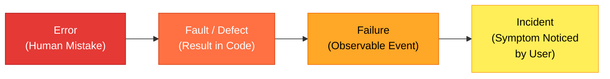
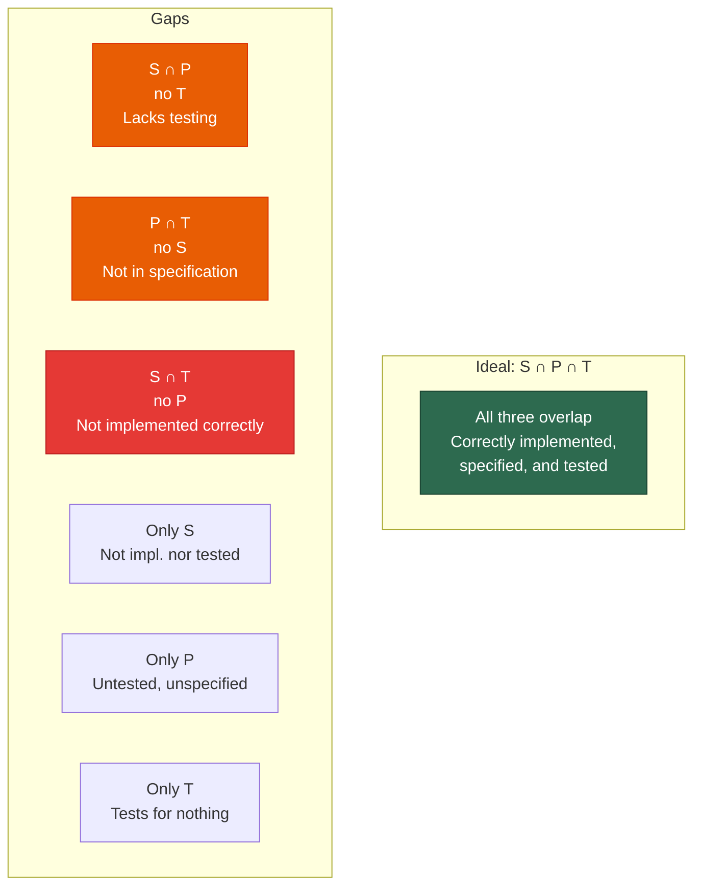
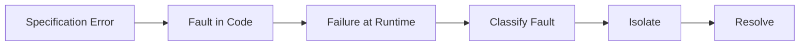

# Lecture 02 — Basic Concepts & Terminology

## 📌 Overview

This lecture establishes the fundamental vocabulary of software testing: the **error → fault → failure → incident** hierarchy, what constitutes a [[Test Case]], the distinction between specification-based and code-based testing, [[Fault Taxonomies]], and the levels of testing in the waterfall model.

---

## 1 · Core Terminology

### Error → Fault → Failure → Incident

| Term | Definition | Example |
|------|------------|---------|
| **Error** | A **mistake** made by a human (developer, analyst, etc.) | Misinterpreting a requirement |
| **Bug** | A mistake made specifically **during coding** | Typo in a condition |
| **Fault (Defect)** | The **result of an error** in the software artifact | Something missing (omission) or incorrect (commission) |
| **Failure** | An **event** that occurs when code containing a fault is executed | System crash, wrong output |
| **Incident** | The **symptom** associated with a failure that alerts the user | Error message, unexpected behaviour |

> [!warning] Error Propagation
> Errors **propagate** — if you make an error in interpreting a requirement, it affects your software all the way down the development chain!

#### Omission vs. Commission Faults

| Fault Type | Description | Example |
|------------|-------------|---------|
| **Omission** | Something **missing** that should be present | Not adding a buy transaction to the debit |
| **Commission** | Entering something **incorrect** into a presentation | Adding a buy transaction to the debit when it is cancelled |

### Test & Test Case

> [!definition] Test
> A **process** to detect errors, faults, and failures. The aim is to **find failures** and **assure correct performance**.

> [!definition] Test Case
> A **scenario** with a set of **inputs** and **expected outputs** related to a software behaviour. Every TC must have:
> 1. **Precondition** — the state before execution
> 2. **Input** — the data provided
> 3. **Expected output & postconditions** — what should happen

Test cases need to be **developed, reviewed, used, managed, and saved**.

#### Test Case Execution Process

1. Prepare preconditions
2. Enter the inputs
3. Observe the outputs
4. Compare with expected outputs
5. Ensure expected postconditions exist → determine **pass/fail**

---

## 2 · Specified, Implemented, and Program Behaviours

| Scenario | Meaning |
|----------|---------|
| **S ∩ P ∩ T** | Ideal — everything correct |
| **S ∩ P** (no T) | Correctly implemented but **lacks testing** |
| **P ∩ T** (no S) | Tested and matches implementation but **not in specification** |
| **S ∩ T** (no P) | Specified and tested but **program fails to execute correctly** |
| **Only S** | Neither implemented nor tested |
| **Only P** | Code behaviour that is unspecified and completely untested |
| **Only T** | Test cases evaluating scenarios outside P and S |
| **U (outside all)** | Everything external — unknown behaviours |

---

## 3 · Specification-Based vs. Code-Based Test Identification

### Specification-Based (Functional / Black-Box)

Deriving test cases **only from the specification** without looking at the code structure.

- **Objective:** Establish confidence that the software acts according to its requirements
- **Techniques:** [[Boundary Value Testing]], [[Equivalence Class Testing]], [[Decision Table Testing]]

### Code-Based (Structural / White-Box)

Deriving test cases **from the source code** itself.

- **Objective:** Analyse all paths, data flows, loops, and variables
- **Techniques:** [[Path Testing]], [[Data Flow Testing]]

---

## 4 · Fault Taxonomies

### Process vs. Product

| Concept | Focus |
|---------|-------|
| **Process** | How we do something |
| **Product** | The end result of a process |
| **Testing** | Product-oriented |
| **SQA** | Process-oriented (improves product by improving process) |

### Classification Criteria

Faults can be classified based on:
- **Development phase**
- **Consequences** of corresponding failures
- **Difficulty to resolve**
- **Risk** of no resolution

### By Occurrence Pattern

- **One time only**
- **Intermittent**
- **Recurring**
- **Repeatable**

### Common Fault Types

#### IO Faults

| Type | Instances |
|------|-----------|
| **Input** | Correct input not accepted; Incorrect input accepted; Description wrong/missing; Parameters wrong/missing |
| **Output** | Wrong format; Wrong result; Correct result at wrong time; Incomplete/missing result; Spurious result; Spelling/grammar; Cosmetic |

#### Logic Faults

Missing case(s), Duplicate case(s), Extreme condition neglected, Misinterpretation, Missing condition, Extraneous condition(s), Test of wrong variable, Incorrect loop iteration, Wrong operator (e.g., `<` instead of `≤`)

#### Computation Faults

Incorrect algorithm, Missing computation, Incorrect operand, Incorrect operation, Parenthesis error, Insufficient precision (round-off, truncation), Wrong built-in function

#### Interface Faults

Incorrect interrupt handling, I/O timing, Call to wrong procedure, Parameter mismatch (type, number), Incompatible types, Superfluous inclusion

#### Data Faults

Incorrect initialization, Incorrect storage/access, Wrong flag/index value, Incorrect packing/unpacking, Wrong variable used, Wrong data reference, Scaling or units error, Incorrect data dimension, Incorrect subscript, Incorrect type, Incorrect data scope, Sensor data out of limits, Off by one, Inconsistent data

---

## 5 · Testing Life Cycle

Flaws originate as **human errors** in the specification phase. If not corrected, they lead to faults in the code and eventual failures during execution.

---

## 6 · Testing Levels (Waterfall Model)

Development phases explicitly map to verification tiers:

| Development Phase | Testing Level | Focus |
|-------------------|---------------|-------|
| **Requirements Specification** | [[System Testing]] | End-to-end verification against business specs |
| **Preliminary Design** | [[Integration Testing]] | High-level subsystem interactions and interfaces |
| **Detailed Design** | [[Unit Testing]] | Individual code modules, functions, or blocks |
| **Coding** | (Central translation phase) | Turns design into logic |

---

## 7 · Key Takeaways

1. **Error** → human mistake; **Fault** → result in code; **Failure** → observable event; **Incident** → symptom noticed by user
2. A [[Test Case]] must have: Precondition, Input, Expected output/postconditions
3. **S (Specification) ∩ P (Program) ∩ T (Test)** is the ideal; gaps reveal problems
4. **Specification-based** testing is black-box; **Code-based** testing is white-box
5. Faults can be classified by phase, consequence, difficulty, risk, occurrence pattern, or type (IO, Logic, Computation, Interface, Data)
6. Testing levels mirror development phases in the waterfall model

---

## 📚 References

- Jorgensen, P. C. (2014). *Software Testing and Analysis, A Craftsman's Approach*. CRC Press. **Chapter 1.**
- Ammann, P. & Offutt, J. (2008). *Introduction to Software Testing*. Cambridge University Press.
- Myers, G. J. (2012). *The Art of Software Testing*. John Wiley & Sons.
- Pezzè, M. & Young, M. (2008). *Software Testing and Analysis: Process, Principles, and Techniques*. Wiley.

---

← [[Lecture 01 - Introduction to Software Testing]] | [[Intro to Software Testing MOC]] | [[Lecture 03 - Boundary Value Testing]] →
