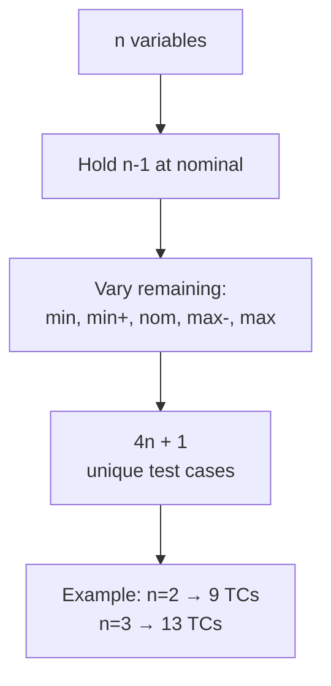

# Lecture 03 — Boundary Value Testing

## 📌 Overview

This lecture introduces the concept of a **unit** in software testing and the first specification-based technique: **[[Boundary Value Testing]] (BVT)**. We explore what constitutes a unit, how to model it as a mathematical function, and how BVT works through the [[Triangle Problem]].

---

## 1 · What Is a Unit?

### Different Interpretations

There is no single agreed-upon definition:

- A **single procedure**
- A **function**
- A **body of code** that implements a single function
- Source code that **fits on one page**
- Work done in **4 to 40 hours** (work breakdown structure)
- The **smallest body of code** that can be compiled and executed by itself

### In Object-Oriented Terminology

The general agreement is that a **class is a unit**. However, methods of a class might be limited by any of the above "definitions" for procedural code.

> [!important] Key Message
> When you start developing software, **have a clear definition among your team** about how you define a unit. **Do not take a single definition for granted.**

### Unit as a Mathematical Function

Informally, a function **maps a domain to a range**. That is what a unit also does:

```
Input --------→ function ----------→ output
```

---

## 2 · Boundary Value Testing

### What Is It?

[[Boundary Value Testing]] (BVT) is a **specification-based** (black-box) testing technique. It is also called **Input Domain Testing**. We can use it to develop **range-based** test cases.

### Two Independent Considerations

1. **Are we concerned with invalid values?**
   - **Normal BVT** — concerned only with **valid** values of input variables
   - **Robust BVT** — considers both **invalid and valid** variable values

2. **Do we make the single fault assumption?**
   - Assumes faults are due to incorrect values of a **single variable**
   - If interaction among variables is a concern → take the **cross product**

### Four Types of BVT

| Type | Invalid Values? | Single Fault Assumption? |
|------|----------------|------------------------|
| **Normal BVT** | ❌ No | ✅ Yes |
| **Robust BVT** | ✅ Yes | ✅ Yes |
| **Worst-Case BVT** | ❌ No | ❌ No (all combinations) |
| **Robust Worst-Case BVT** | ✅ Yes | ❌ No (all combinations) |

### Boundary Values

Tools usually refer to boundary values as:

| Common Values | Robust Adds |
|---------------|-------------|
| Min | Min− |
| Min+ | Max+ |
| Nom (or Mid) | |
| Max− | |
| Max | |

---

## 3 · The Triangle Problem

### Problem Statement

The triangle program accepts **three integers**, $a$, $b$, and $c$, as input — the sides of a triangle.

**Output:** The type of triangle determined by the three sides, or `NotATriangle`:

- **Equilateral** — all three sides equal
- **Isosceles** — exactly two sides equal
- **Scalene** — all sides different
- **NotATriangle** — violates the triangle inequality ($a + b \leq c$, etc.)

---

## 4 · BVT for a Function of Two Variables

Consider $F(x_1, x_2)$ where $a \leq x_1 \leq b$ and $c \leq x_2 \leq d$.

### Normal BVT Test Cases

The test cases are: {⟨x1_nom, x2_min⟩, ⟨x1_nom, x2_min+⟩, ⟨x1_nom, x2_nom⟩, ⟨x1_nom, x2_max−⟩, ⟨x1_nom, x2_max⟩, ⟨x1_min, x2_nom⟩, ⟨x1_min+, x2_nom⟩, ⟨x1_max−, x2_nom⟩, ⟨x1_max, x2_nom⟩}

This yields **$4n + 1$** test cases for $n$ variables (the four extremes per variable plus the all-nominal case).

> [!tip] Key Insight About Corners
> With BVT for two variables, you **don't test the corners** of the input space (e.g., ⟨min, min⟩, ⟨min, max⟩, ⟨max, min⟩, ⟨max, max⟩). Only Worst-Case BVT covers those.

---

## 5 · Generalizing BVT

### By Number of Variables

For $n$ variables:
1. Hold all but one at nominal values
2. Let the remaining variable assume `min`, `min+`, `nom`, `max−`, `max`
3. Repeat for each variable
4. Result: **$4n + 1$** unique test cases

### By Types of Ranges

Depends on the **nature** of the variables and the **programming language**:

| Range Type | How to Determine |
|------------|-----------------|
| Discrete, bounded | `min`, `min+`, `nom`, `max−`, `max` are easy to set |
| No explicit bound | Assume bounds (based on experience and application domain) |
| Boolean/logical variables | BVT does not make sense (only two values) |

### The $4n + 1$ Formula



---

## 6 · Limitations of BVT

### When BVT Works Well

- Functions with **several independent variables** representing **bounded physical quantities**
- Variables described by a **true ordering relation** (for every pair $\langle a, b \rangle$, either $a \leq b$ or $b \leq a$)
- **Examples:** temperature, pressure, load

### When BVT Does NOT Work

- **Dependent** variables
- **Non-physical** variables (e.g., colours, PINs, telephone numbers)

---

## 7 · Key Takeaways

1. A **unit** has many definitions — agree on one with your team
2. BVT is a **specification-based** technique focused on input domain boundaries
3. Normal BVT uses only valid values; Robust adds invalid values
4. The **single fault assumption** keeps BVT tractable ($4n + 1$ TCs)
5. Worst-case BVT drops this assumption → more thorough but more expensive
6. BVT works well for **physical quantities with ordering relations**; fails for logical/non-physical variables

---

## 📚 References

- Jorgensen, P. C. (2014). *Software Testing and Analysis, A Craftsman's Approach*. CRC Press. **Chapters 2 & 5.**
- Ammann, P. & Offutt, J. (2008). *Introduction to Software Testing*. Cambridge University Press.
- Myers, G. J. (2012). *The Art of Software Testing*. John Wiley & Sons.
- Pezzè, M. & Young, M. (2008). *Software Testing and Analysis: Process, Principles, and Techniques*. Wiley.

---

← [[Lecture 02 - Basic Concepts and Terminology]] | [[Intro to Software Testing MOC]] | [[Lecture 04 - BVT Examples and Robustness]] →
