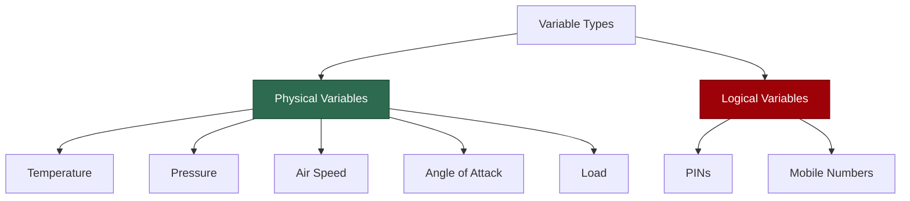
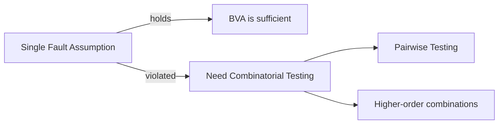
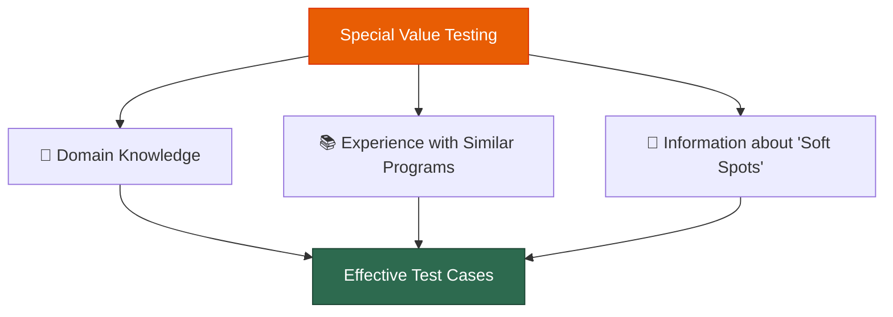

# Lecture 05 — BVT Limitations & Special Value Testing

## 📌 Overview

This lecture continues [[Boundary Value Testing]] by exploring how to **generalize** BVA to more variables and range types, examines its **limitations**, introduces the **single fault assumption**, and presents [[Special Value Testing]] as a complementary, experience-driven technique.

---

## 1 · Generalizing Boundary Value Analysis

There are **two ways** to generalize [[Boundary Value Analysis]]:

### 1.1 By the Number of Variables

For a function of **$n$ variables**:

1. Hold all but one variable at their **nominal** values.
2. Let the remaining variable take the values: `min`, `min+`, `nom`, `max−`, `max`.
3. Repeat for each variable.

> [!definition] BVA Test Case Count
> For $n$ variables, normal BVA produces exactly $4n + 1$ unique [[Test Case|test cases]].

This formula comes from: each variable contributes 4 non-nominal values (min, min+, max−, max), and the single all-nominal case is shared → $4n + 1$.

### 1.2 By the Kinds of Ranges

The type of boundary values depends on the **nature/type** of the variables:

| Situation | How to Determine BV Values |
|---|---|
| Discrete, bounded variables (e.g., [[Commission Problem]]) | `min`, `min+`, `nom`, `max−`, `max` are easily determined |
| No explicit bounds (e.g., [[Triangle Problem]]) | Create **artificial bounds** (e.g., side lengths 1–200) |
| Variables with an ordering relation | Infer boundary values from context (e.g., alphabet chars → `{a, b, m, y, z}`) |
| **Boolean** variables | BVA does **not** make sense — only two values exist, no meaningful "boundary" |

> [!tip] Key Insight
> As long as a variable supports an **ordering relation**, we can usually infer min, min+, nominal, max−, and max values.

---

## 2 · Limitations of Boundary Value Analysis

### 2.1 When BVA Works Well

BVA is effective when the program under test is a function of several **independent variables** that represent **bounded physical quantities**.

### 2.2 The Ordering Relation Requirement

Mathematically, the variables need a **true ordering relation**:
- For every pair ⟨a, b⟩ of values, it must be possible to say $a \leq b$ or $b \leq a$.

> [!warning] Variables Without Ordering
> Sets of car colours, football teams, or categorical data **do not** support an ordering relation → BVA is **not appropriate** for such variables.

### 2.3 Physical vs. Logical Variables

**Physical variables** (temperature, pressure, air speed, angle of attack, load) — their boundaries **are** crucial and BVA makes perfect sense.

**Logical variables** (PINs, mobile numbers) — testing PIN values of `0000, 0001, 5000, 9998, 9999` or mobile numbers `000 000 000` and `999 999 999` is unlikely to reveal meaningful faults, because these are **not physical quantities** with meaningful extremes.

### 2.4 Summary of BVA Limitations

BV analysis test cases are derived from the extrema of:
- **Bounded**, **independent** variables referring to **physical quantities**
- With **no consideration** of the nature of the function
- And **no consideration** of the semantic meaning of the variables

This raises the question: *Is this method always appropriate for software testing?*

---

## 3 · Assumptions Behind BVA

### 3.1 The Single Fault Assumption

> [!definition] Single Fault Assumption
> Failures are only **rarely** the result of the **simultaneous occurrence** of two or more faults. This assumption comes from **reliability theory**.

This is the critical assumption underlying [[Boundary Value Testing]]. All basic BVA variations hold all but one variable at nominal and vary only one at a time.

### 3.2 When the Assumption Breaks Down

In practice — particularly in **software-controlled medical systems** — almost all faults result from the **interaction between a pair of variables**, and sometimes even more variables are involved.

### 3.3 The Solution: Combinatorial Testing

> [!important] Combinatorial / Pairwise Testing
> When faults arise from variable interactions, [[Combinatorial Testing]] (specifically [[Pairwise Testing]]) is the appropriate technique. This will be discussed in later lectures.

---

## 4 · Special Value Testing

### 4.1 What Is It?

> [!definition] Special Value Testing
> The most widely practiced form of [[Functional Testing]]. A tester devises test cases using **domain knowledge**, **experience with similar programs**, and **information about "soft spots"** (weak and vulnerable points in the software).

### 4.2 Characteristics

| Aspect | Description |
|---|---|
| **Other name** | [[Ad Hoc Testing]] |
| **Guidelines** | None — relies on "best engineering judgment" |
| **Uniformity** | Least uniform of all techniques |
| **Dependency** | Very dependent on the **abilities of the tester** |
| **Effectiveness** | Despite negatives, often produces a **more effective** set of test cases than BVA |

> [!tip] Software Testing Is Craft!
> Special value testing is highly subjective, but it often results in a more effective set of test cases than BVA alone can provide. This is why software testing is considered a **craft**.

### 4.3 Special Values for NextDate

For the [[NextDate Function]], special value test cases would include scenarios involving:

- **February 28** — last day of February in common years
- **February 29** — leap year day
- **Leap years** — century years divisible by 400, non-century years divisible by 4

These are "special" because they represent points where the [[NextDate Function]]'s logic is most complex and most likely to contain faults.

### 4.4 The Three Pillars of Special Value Testing

---

## 5 · Practice: ValidatePasswordConditions

### Problem Statement

`ValidatePasswordConditions` is a function that validates whether a chosen password during **sign-up** or **password change** complies with conditions that make a password considered highly safe.

**Input:** Password (string)

**Output (classification):**

| Level | Meaning |
|---|---|
| **Unacceptable** | Fails minimum requirements |
| **Weak** | Meets bare minimum |
| **Moderate** | Some strength criteria met |
| **Safe** | Most criteria met |
| **Robust** | All criteria met — highly safe |

### Task

> [!example] Practice Exercise
> Design [[Test Case|test cases]] based on [[Special Value Testing]]:
> - Think about **common weak passwords** (e.g., `123456`, `password`)
> - **Edge-length passwords** (minimum and maximum length)
> - Passwords with **only letters**, **only numbers**, **special characters**
> - **Unicode/emoji** characters
> - **SQL injection** strings
> - **Empty string** and **whitespace-only** inputs
> - Known **dictionary words** vs. random strings

---

## 6 · Key Takeaways

1. BVA generalizes to $n$ variables → $4n + 1$ test cases (normal BVA)
2. BVA requires variables with **ordering relations** over **bounded physical quantities**
3. BVA fails for **logical variables** (PINs, mobile numbers) and **categorical data**
4. The **single fault assumption** is often violated in real software
5. [[Special Value Testing]] uses **domain expertise** and is a **craft** — often more effective than systematic BVA

---

## 📚 References

- Jorgensen, P. C. (2014). *Software Testing and Analysis, A Craftsman's Approach*. CRC Press. **Chapter 5.**
- Ammann, P. & Offutt, J. (2008). *Introduction to Software Testing*. Cambridge University Press.
- Myers, G. J. (2012). *The Art of Software Testing*. John Wiley & Sons.
- Pezzè, M. & Young, M. (2008). *Software Testing and Analysis: Process, Principles, and Techniques*. Wiley.

---

← [[Lecture 04 - Boundary Value Testing Continued]] | [[Intro to Software Testing MOC]] | [[Lecture 06 - Random Testing and BVT Guidelines]] →
