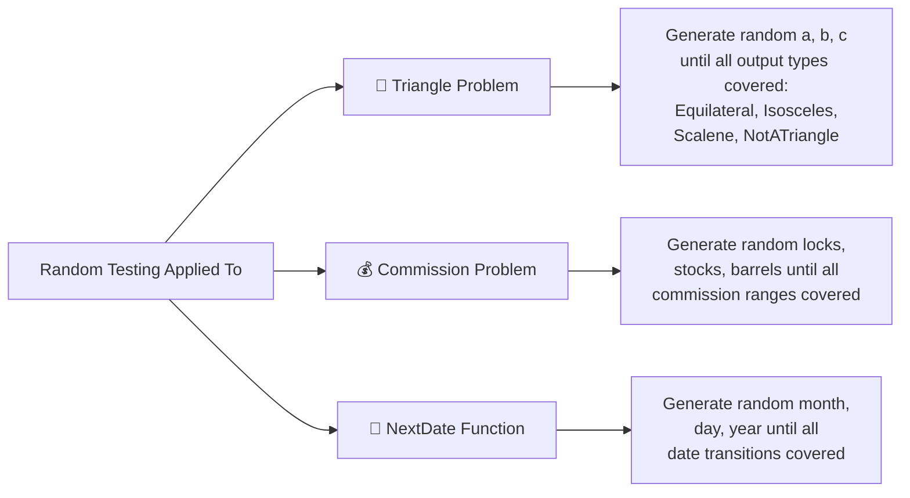
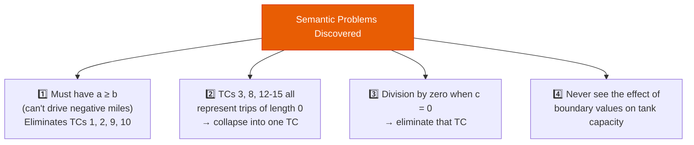

# Lecture 06 — Random Testing & BVT Guidelines

## 📌 Overview

This lecture concludes the [[Boundary Value Testing]] unit with two remaining topics: **[[Random Testing]]** as an unbiased alternative to deterministic BVA, and a set of practical **guidelines** for applying BVT effectively. The concept of the **testing pendulum** (syntactic vs. semantic) is introduced through the miles-per-gallon example.

---

## 1 · Random Testing

### 1.1 Core Idea

> [!definition] Random Testing
> Instead of always choosing `min`, `min+`, `nom`, `max−`, and `max` values, use a **random number generator** to pick test case values from within the bounded range.

- Long history of discussion, mostly among **academics**.
- Statistically interesting and **avoids any form of bias** in testing.

### 1.2 The Key Question

> *How many random test cases are sufficient?*

This question gets a proper answer when we discuss **structural test coverage metrics** in later lectures.

### 1.3 Random Number Generation Formula

> [!definition] Random Value Formula
> $$x = \text{Int}((b - a + 1) \times \text{Rnd} + a)$$
> Generates a random integer $x$ such that $a \leq x \leq b$.

| Component | Meaning |
|---|---|
| `Int()` | Returns the integer part of a floating-point number |
| `Rnd` | Generates a random number in the interval $[0, 1]$ |
| `a` | Lower bound of the range |
| `b` | Upper bound of the range |

### 1.4 Generation Strategy

The program generates random test cases **until at least one of each output type occurs**. In the textbook examples, the program went through **seven "cycles"** that ended with the "hard-to-generate" test case.

### 1.5 Random TCs for the Three Examples

| Program | Input Variables | Outputs to Cover |
|---|---|---|
| [[Triangle Problem]] | a, b, c (sides) | Equilateral, Isosceles, Scalene, NotATriangle |
| [[Commission Problem]] | locks, stocks, barrels | All commission rate brackets |
| [[NextDate Function]] | month, day, year | All date-transition scenarios |

---

## 2 · Guidelines for Boundary Value Testing

### Guideline 1: Independent Variables Assumption

> [!warning] Common Assumption
> Test methods based on the input domain assume that **input variables are truly independent**. Usually, **that is not the case**.

In the [[Triangle Problem]], sides a, b, c are **not** independent — they must satisfy the triangle inequality. In the [[NextDate Function]], month, day, and year interact (e.g., February has fewer days).

### Guideline 2: Output Range Testing

Each BVT method can be applied to the **output range** of a program, not just the input domain.

- We saw this for the [[Commission Problem]] — defining test cases based on commission brackets.
- Particularly useful for systems that generate **error messages**: devise test cases to check that error messages are generated **when appropriate** and are **not falsely generated**.

### Guideline 3: Internal Variables

BVA can also be used for **internal variables** that are not program inputs:

| Internal Variable Type | Examples |
|---|---|
| Loop control variables | `for i = 0 to n` |
| Indices | Array index boundaries |
| Pointers | Null, first, last element |

> [!tip] Robustness Testing
> [[Robustness Testing]] is a good choice for testing internal variables, since errors in their use are quite common.

### Guideline 4: The Testing Pendulum — Syntactic vs. Semantic

> [!definition] The Testing Pendulum
> The problem of **syntactic versus semantic** approaches to developing test cases. A purely syntactic (automated) approach may miss critical domain-specific insights, while a purely semantic approach depends on human expertise.

---

## 3 · Miles Per Gallon Example (The Testing Pendulum in Action)

### 3.1 Problem Setup

Consider function $F$ of three variables $a$, $b$, and $c$:

$$F = \frac{a - b}{c}$$

| Variable | Bounds |
|---|---|
| $a$ | $0 \leq a < 10{,}000$ |
| $b$ | $0 \leq b < 10{,}000$ |
| $c$ | $0 \leq c < 18.8$ |

### 3.2 Syntactic (Tool-Generated) Test Cases

A [[Boundary Value Testing]] tool would generate normal BVTCs (test cases 1–4 for variable $c$, etc.), but:

- ❌ A tool would **not** generate expected output values
- ❌ The syntactic version is **problematic** — it does not account for what the variables mean

### 3.3 Adding Semantic Information

When we know that $F$ calculates **miles per gallon** of an automobile:
- $a$ = **end** trip odometer reading
- $b$ = **start** trip odometer reading
- $c$ = **gas tank capacity** (gallons)

Semantic problems emerge:

### 3.4 Lessons from the Example

| Issue | Syntactic Approach | Semantic Approach |
|---|---|---|
| Negative miles | Generates these TCs | Eliminates impossible TCs |
| Zero-length trips | Multiple redundant TCs | Collapses to one TC |
| Division by zero | Includes it blindly | Recognises and handles it |
| Tank capacity boundaries | Never tested properly | Explicitly addressed |

> [!important] Key Takeaway
> Neither purely syntactic nor purely semantic approaches are sufficient alone. The best testing combines **automated generation** with **domain knowledge** — the pendulum should rest in the middle.

---

## 4 · Tools for Black-Box Testing

| Tool / Resource | URL |
|---|---|
| AI Assistants | ChatGPT, Claude, etc. |
| Mobot | https://www.mobot.io/blog/blackbox-testing-tools-a-complete-guide |
| Test.io | https://test.io/black-box-testing |
| IBM DevOps Test UI | https://www.ibm.com/products/devops-test/ui |
| QA Wolf | https://www.qawolf.com/ |
| Ranorex | https://www.ranorex.com/free-trial/ |
| LDRA TBextreme | https://ldra.com/products/tbextreme/ |
| Katalon | https://katalon.com/download |

---

## 5 · Practice: Miles Per Gallon with Special Value Testing

> [!example] Practice Exercise
> Apply [[Special Value Testing]] to the miles-per-gallon example:
> - What **domain-specific** test cases would you choose?
> - Consider: very short trips, very long trips, nearly empty tank, full tank, exactly 1 gallon used
> - Think about **edge cases** in real driving scenarios
> - Provide **reasons** for each chosen test case

---

## 6 · Key Takeaways

1. [[Random Testing]] avoids bias by using random number generation: $x = \text{Int}((b-a+1) \times \text{Rnd} + a)$
2. The sufficiency of random test cases depends on **structural coverage metrics** (covered later)
3. BVT assumes **independent** input variables — often violated in practice
4. BVA can target **output ranges**, **error messages**, and **internal variables** (not just inputs)
5. The **testing pendulum**: purely syntactic approaches miss semantic faults; combine both
6. The miles-per-gallon example shows how semantic knowledge reveals problems that syntactic BVA misses

---

## 📚 References

- Jorgensen, P. C. (2014). *Software Testing and Analysis, A Craftsman's Approach*. CRC Press. **Chapter 5.**
- Ammann, P. & Offutt, J. (2008). *Introduction to Software Testing*. Cambridge University Press.
- Myers, G. J. (2012). *The Art of Software Testing*. John Wiley & Sons.
- Pezzè, M. & Young, M. (2008). *Software Testing and Analysis: Process, Principles, and Techniques*. Wiley.

---

← [[Lecture 05 - BVT Limitations and Special Value Testing]] | [[Intro to Software Testing MOC]] | [[Lecture 07 - Equivalence Class Testing]] →
