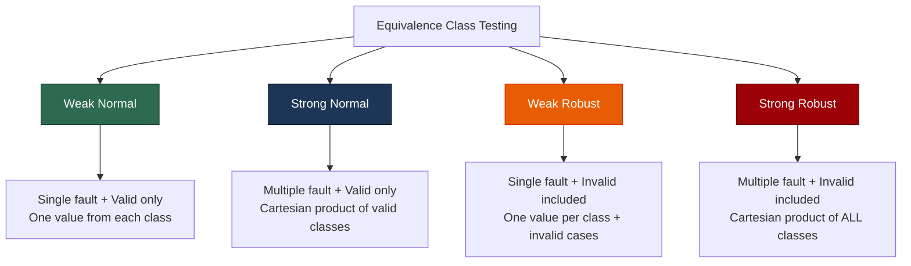
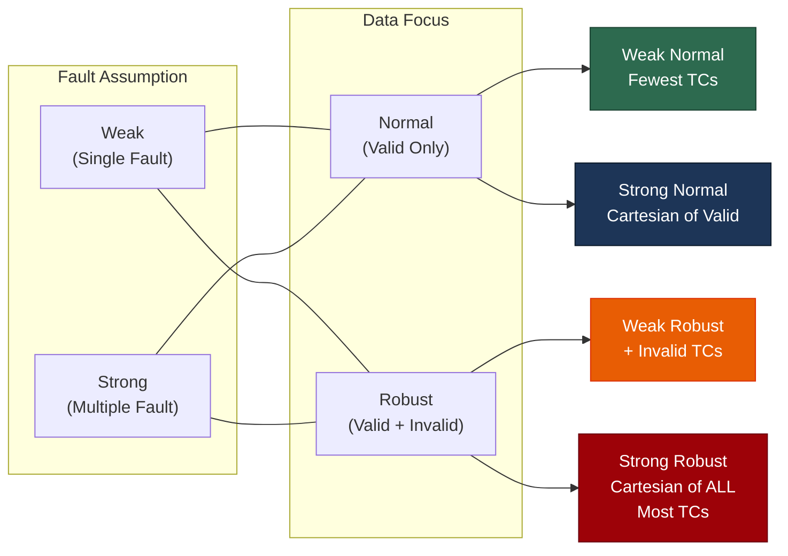

# Lecture 07 — Equivalence Class Testing

## 📌 Overview

[[Equivalence Class Testing]] (ECT) addresses two fundamental concerns that [[Boundary Value Testing]] cannot: achieving a sense of **completeness** while avoiding **redundancy**. By partitioning the input domain into equivalence classes, we ensure every "kind" of input is tested exactly once.

---

## 1 · Why Equivalence Classes?

### 1.1 The Two Wishes

| Concern | BVT Problem | ECT Solution |
|---|---|---|
| **Completeness** | Serious gaps in coverage | Union of all classes = entire input domain |
| **Non-redundancy** | Massive redundancy in test tables | Classes are mutually disjoint |

### 1.2 Theoretical Foundation — Partitions

> [!definition] Partition of a Set
> A **partition** is a collection of subsets that are:
> 1. **Mutually disjoint** — no element belongs to two subsets
> 2. **Exhaustive** — their union is the entire set
>
> These two properties give us **non-redundancy** and **completeness** respectively.

**Example from the [[Triangle Problem]]:**
- Test case `(5, 5, 5)` represents the equilateral class
- Can we learn much more from `(6, 6, 6)` and `(50, 50, 50)`? **No** — they are in the same equivalence class

---

## 2 · The Four Types of Equivalence Class Testing

ECT borrows two distinctions from [[Boundary Value Testing]]:

| Distinction | Produces | Meaning |
|---|---|---|
| Single vs. Multiple fault assumption | **Weak** vs. **Strong** | Weak = one variable at a time; Strong = all combinations |
| Focus on invalid data | **Normal** vs. **Robust** | Normal = valid inputs only; Robust = includes invalid inputs |

These combine into **four types**:

### Problems with Robust Forms

> [!warning] Robust Form Issues
> 1. Specifications often **don't define** what the expected output for invalid input should be.
> 2. **Strongly typed** languages eliminate the need for invalid input consideration (the compiler catches them).

---

## 3 · Traditional Equivalence Class Testing

### 3.1 The GIGO Era

> [!definition] Traditional ECT
> Based on two categories for variables: **Valid** and **Invalid**. Focuses heavily on invalid data values — a consequence of the "**Garbage In, Garbage Out**" (GIGO) programming style of the 1960s–1970s.

Traditional ECT is almost identical to [[Weak Robust Equivalence Class Testing]].

### 3.2 Process for $n$ Variables

1. Test $F$ for **valid values** of all variables.
2. If Step 1 succeeds, test $F$ with an **invalid value of $x_1$** while keeping all remaining variables valid. Any failure is due to the invalid $x_1$.
3. Repeat Step 2 for each remaining variable.

**Advantage:** Focuses on finding faults due to invalid data.
**Limitation:** Ignores the combinatorial interactions seen in worst-case BVT variations.

---

## 4 · Improved Equivalence Class Testing

### 4.1 The Key Craft

> [!important] The Craft of ECT
> The key to good equivalence class testing is the **choice of the equivalence relation** that determines the classes. We often "second-guess" the likely implementation and think about the functional manipulations that must be present.

### 4.2 Formal Setup

Consider function $F$ with two variables $x_1$ and $x_2$:

| Variable | Range | Intervals |
|---|---|---|
| $x_1$ | $a \leq x_1 \leq d$ | $[a, b)$, $[b, c)$, $[c, d]$ |
| $x_2$ | $e \leq x_2 \leq g$ | $[e, f)$, $[f, g]$ |

> [!note] Interval Notation
> `[ ]` = closed endpoint (inclusive), `( )` = open endpoint (exclusive)

### 4.3 Valid Equivalence Classes

$$V_1 = \{x_1 : a \leq x_1 < b\}$$
$$V_2 = \{x_1 : b \leq x_1 < c\}$$
$$V_3 = \{x_1 : c \leq x_1 \leq d\}$$
$$V_4 = \{x_2 : e \leq x_2 < f\}$$
$$V_5 = \{x_2 : f \leq x_2 \leq g\}$$

### 4.4 Invalid Equivalence Classes

$$NV_1 = \{x_1 : x_1 < a\}$$
$$NV_2 = \{x_1 : d < x_1\}$$
$$NV_3 = \{x_2 : x_2 < e\}$$
$$NV_4 = \{x_2 : g < x_2\}$$

> The intervals correspond to distinctions in the program being tested (e.g., the commission ranges in the [[Commission Problem]]).

---

## 5 · The Four Types in Detail

### 5.1 Weak Normal Equivalence Class Testing

- All equivalence classes $V_1$ through $V_5$, $NV_1$ through $NV_4$ are **disjoint** and their union is the **entire plane**.
- **Weak normal:** Use **one value from each equivalence class** (interval) in a test case.
- This reflects the [[Single Fault Assumption]].

> [!definition] Weak Normal ECT
> Select one representative value from each valid equivalence class. The number of test cases = $\max(\text{number of classes per variable})$.

### 5.2 Strong Normal Equivalence Class Testing

- Based on the **multiple fault assumption**.
- Test cases come from each element of the **Cartesian product** of the equivalence classes.

> [!definition] Strong Normal ECT
> Generate test cases for **every combination** of valid equivalence classes across all variables.
> For our example: $3 \times 2 = 6$ test cases.

The Cartesian product guarantees **completeness**: every equivalence class is covered, and we have one of each possible combination of inputs.

> [!tip] Truth Table Similarity
> The pattern of strong normal test cases resembles the construction of a **truth table** in propositional logic.

**Key to good ECT:** selection of the equivalence relation — watch for inputs that are "**treated the same**."

**Output-based classes:** There is no reason not to define equivalence relations on the **output range** — sometimes that is the simplest approach (think about the [[Triangle Problem]]).

### 5.3 Weak Robust Equivalence Class Testing

> [!definition] Weak Robust ECT
> **Robust** → considers invalid values. **Weak** → [[Single Fault Assumption]].

Process:
1. **For valid inputs:** Use one value from each valid class (same as weak normal).
2. **For invalid inputs:** Each test case has **one invalid value** with all remaining values valid → a "single failure" should cause the test case to fail.

**Potential problem:** Test cases in corners of the input space (e.g., upper-left, lower-right) may represent values from **two invalid** equivalence classes, making it unclear which variable caused the failure.

#### Revised Weak Robust ECT

A compromise between pure weak normal and its robust extension — adjusts the placement of invalid test points to avoid the corner ambiguity problem.

### 5.4 Strong Robust Equivalence Class Testing

> [!definition] Strong Robust ECT
> **Robust** → considers invalid values. **Strong** → multiple fault assumption.
> Test cases from each element of the **Cartesian product** of **all** equivalence classes (both valid and invalid).

This is the most thorough but also the most expensive form.

### Comparison Summary

---

## 6 · Practice: CalculateShippingCost

### Problem Statement

| Attribute | Details |
|---|---|
| **Function** | `CalculateShippingCost` — calculates shipping cost based on weight, speed, and zone |
| **Output** | Amount in IQD |

### Inputs

| Input | Type | Valid Range |
|---|---|---|
| **Weight** (kg) | Number | 0.1 to 100.0 (inclusive) |
| **Shipping Speed** | String | `"standard"`, `"express"`, `"overnight"` |
| **Shipping Area** | Number | 1 to 10 (inclusive) |

### Task

> [!example] Practice Exercise
> 1. **Identify** valid and invalid equivalence classes for each input
> 2. **Design** test cases that cover each class
> 3. Apply weak normal, strong normal, weak robust, and strong robust strategies

**Suggested valid classes:**

| Variable | Classes |
|---|---|
| Weight | Light (0.1–10), Medium (10.1–50), Heavy (50.1–100) |
| Speed | Standard, Express, Overnight |
| Area | Local (1), Regional (2–5), Distant (6–10) |

**Suggested invalid classes:**

| Variable | Invalid Classes |
|---|---|
| Weight | ≤ 0, > 100 |
| Speed | `"priority"`, `""`, `null` |
| Area | ≤ 0, > 10 |

---

## 7 · Key Takeaways

1. ECT addresses BVT's problems of **redundancy** and **gaps** via **partitioning**
2. Equivalence classes are based on the mathematical concept of **set partitions** (disjoint + exhaustive)
3. Four types: **Weak Normal**, **Strong Normal**, **Weak Robust**, **Strong Robust**
4. The **craft** of ECT lies in choosing the right equivalence relation
5. Traditional ECT focuses on GIGO (valid/invalid), while improved ECT uses **interval-based** classes
6. Robust forms face challenges with unspecified behaviour for invalid inputs and strongly typed languages
7. Equivalence classes can be defined on both **input domain** and **output range**

---

## 📚 References

- Jorgensen, P. C. (2014). *Software Testing and Analysis, A Craftsman's Approach*. CRC Press. **Chapter 6.**
- Ammann, P. & Offutt, J. (2008). *Introduction to Software Testing*. Cambridge University Press.
- Myers, G. J. (2012). *The Art of Software Testing*. John Wiley & Sons.
- Pezzè, M. & Young, M. (2008). *Software Testing and Analysis: Process, Principles, and Techniques*. Wiley.

---

← [[Lecture 06 - Random Testing and BVT Guidelines]] | [[Intro to Software Testing MOC]] | [[Lecture 08 - ECT Examples and Edge Testing]] →
