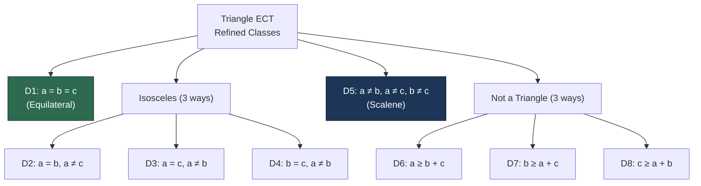
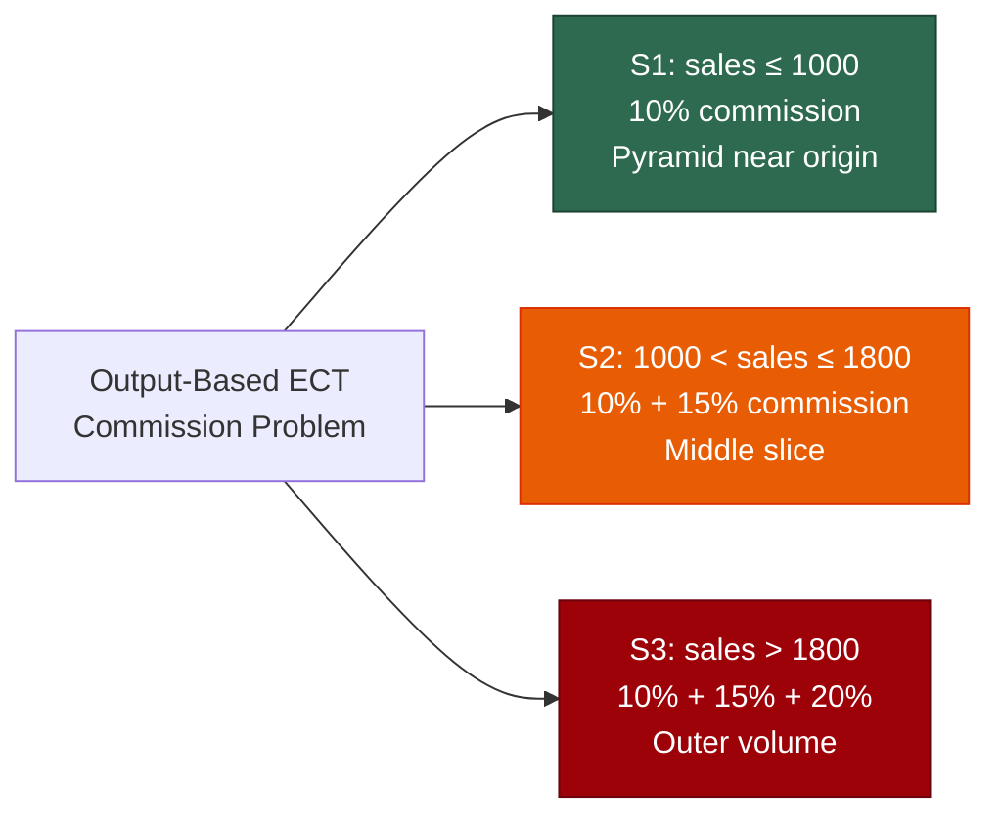
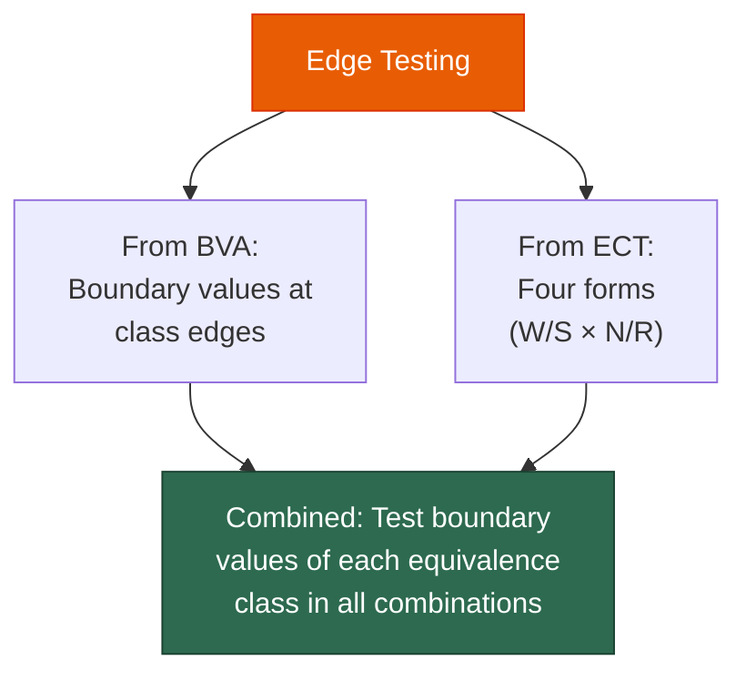

# Lecture 08 — ECT Examples & Edge Testing

## 📌 Overview

This lecture applies [[Equivalence Class Testing]] to the three running examples ([[Triangle Problem]], [[NextDate Function]], [[Commission Problem]]), introduces **[[Edge Testing]]** as a powerful hybrid of [[Boundary Value Testing]] and [[Equivalence Class Testing]], and concludes with **9 guidelines and observations** for effective ECT.

---

## 1 · ECT Example: Triangle Problem

### 1.1 Output-Based Equivalence Classes (R1–R4)

The problem statement defines **four possible outputs**, which naturally form output (range) equivalence classes:

| Class | Definition |
|---|---|
| $R_1$ | $\{\langle a,b,c \rangle :$ the triangle is **equilateral**$\}$ |
| $R_2$ | $\{\langle a,b,c \rangle :$ the triangle is **isosceles**$\}$ |
| $R_3$ | $\{\langle a,b,c \rangle :$ the triangle is **scalene**$\}$ |
| $R_4$ | $\{\langle a,b,c \rangle :$ sides do **not** form a triangle$\}$ |

### 1.2 Test Cases

- **4 weak normal** test cases, chosen arbitrarily from each class (e.g., $(5,5,5)$, $(3,3,5)$, $(3,4,5)$, $(1,2,4)$).
- No valid sub-intervals of $a$, $b$, $c$ exist within each class → **strong normal TCs are identical to weak normal ones**.
- Invalid values for robust extensions could be: **zero**, **negative numbers**, or numbers **> 200** (the artificial upper bound).

### 1.3 Refined Equivalence Classes (D1–D8)

A more crafted analysis based on the **output domain** yields richer classes:

| Class | Definition | Example |
|---|---|---|
| $D_1$ | $a = b = c$ | $(5, 5, 5)$ |
| $D_2$ | $a = b, a \neq c$ | $(3, 3, 5)$ |
| $D_3$ | $a = c, a \neq b$ | $(3, 5, 3)$ |
| $D_4$ | $b = c, a \neq b$ | $(5, 3, 3)$ |
| $D_5$ | $a \neq b, a \neq c, b \neq c$ | $(3, 4, 5)$ |
| $D_6$ | $a \geq b + c$ | $(6, 2, 3)$ |
| $D_7$ | $b \geq a + c$ | $(2, 6, 3)$ |
| $D_8$ | $c \geq a + b$ | $(2, 3, 6)$ |

> [!tip] Even More Thorough
> $D_6$ can be split into $D_6' = \{a = b + c\}$ (degenerate) and $D_6'' = \{a > b + c\}$ (impossible triangle), and similarly for $D_7$ and $D_8$.

Note: $\langle 1, 4, 1 \rangle$ has one pair of equal sides but does **not** form a triangle — the triangle inequality must always be checked separately.

---

## 2 · ECT Example: NextDate Function

### 2.1 Basic Valid and Invalid Classes

| Variable | Valid Class | Invalid Classes |
|---|---|---|
| Month | $M_1 = \{1 \leq \text{month} \leq 12\}$ | $M_2 = \{\text{month} < 1\}$, $M_3 = \{\text{month} > 12\}$ |
| Day | $D_1 = \{1 \leq \text{day} \leq 31\}$ | $D_2 = \{\text{day} < 1\}$, $D_3 = \{\text{day} > 31\}$ |
| Year | $Y_1 = \{1812 \leq \text{year} \leq 2012\}$ | $Y_2 = \{\text{year} < 1812\}$, $Y_3 = \{\text{year} > 2012\}$ |

### 2.2 Refined Equivalence Classes

A much more useful partitioning based on **domain knowledge**:

#### Month Classes

| Class | Definition | Months |
|---|---|---|
| $M_1$ | Month has **30** days | Apr, Jun, Sep, Nov |
| $M_2$ | Month has **31** days | Jan, Mar, May, Jul, Aug, Oct, Dec |
| $M_3$ | Month is **February** | Feb |

#### Day Classes

| Class | Definition |
|---|---|
| $D_1$ | $1 \leq \text{day} \leq 28$ |
| $D_2$ | $\text{day} = 29$ |
| $D_3$ | $\text{day} = 30$ |
| $D_4$ | $\text{day} = 31$ |

#### Year Classes

| Class | Definition |
|---|---|
| $Y_1$ | $\text{year} = 2000$ (century leap year) |
| $Y_2$ | Year is a **non-century leap year** |
| $Y_3$ | Year is a **common year** |

### 2.3 Test Case Counts

| ECT Type | Calculation | Count |
|---|---|---|
| **Strong Normal** | $3 \times 4 \times 3$ | **36 TCs** |
| **Strong Robust** (with 2 invalid classes each) | $5 \times 6 \times 5$ | **150 TCs** |

### 2.4 Issues with Mechanical Selection

> [!warning] Impossible Dates
> Mechanical selection of input values from the middle of each class **makes no consideration of domain knowledge** — this may produce **impossible dates** (e.g., February 31).
> This is an inherent problem with "automatic" test case generation, because domain knowledge is **not fully captured** in the choice of equivalence classes.

---

## 3 · ECT Example: Commission Problem

### 3.1 Input Domain Classes

**Valid classes:**

| Class | Definition |
|---|---|
| $L_1$ | $\{locks: 1 \leq locks \leq 70\}$ |
| $L_2$ | $\{locks = -1\}$ (controls input iteration) |
| $S_1$ | $\{stocks: 1 \leq stocks \leq 80\}$ |
| $B_1$ | $\{barrels: 1 \leq barrels \leq 90\}$ |

**Invalid classes:**

| Class | Definition |
|---|---|
| $L_3$ | $\{locks = 0 \text{ OR } locks < -1\}$ |
| $L_4$ | $\{locks > 70\}$ |
| $S_2$ | $\{stocks < 1\}$ |
| $S_3$ | $\{stocks > 80\}$ |
| $B_2$ | $\{barrels < 1\}$ |
| $B_3$ | $\{barrels > 90\}$ |

> [!note] Natural Partition
> The input domain is "naturally" partitioned by the limits on locks, stocks, and barrels. These are identical to what traditional ECT would identify. However, input domain classes lead to **very unsatisfactory** test cases.

### 3.2 Output-Based Equivalence Classes (The Improvement)

Using the commission formula: $\text{Sales} = 45 \times locks + 30 \times stocks + 25 \times barrels$

| Class | Definition | Geometric Interpretation |
|---|---|---|
| $S_1$ | $\{\langle l, s, b \rangle : \text{sales} \leq 1000\}$ | Pyramid near origin |
| $S_2$ | $\{\langle l, s, b \rangle : 1000 < \text{sales} \leq 1800\}$ | Triangular slice between pyramid and rest |
| $S_3$ | $\{\langle l, s, b \rangle : \text{sales} > 1800\}$ | Remaining rectangular volume |

> All error cases found by strong robust equivalence classes of the input domain are **outside** of the rectangular input space.

---

## 4 · Edge Testing

### 4.1 What Is Edge Testing?

> [!definition] Edge Testing
> A **hybrid** of [[Boundary Value Testing]] and [[Equivalence Class Testing]]. It focuses on potential faults near the **boundaries of equivalence classes** (the "edges" between classes).

### 4.2 When to Use It

When **contiguous ranges** of a particular variable form equivalence classes, there may be faults near the boundaries of those classes.

### 4.3 Edge Test Values

Using the same example with $x_1$ having classes $[a,b)$, $[b,c)$, $[c,d]$ and $x_2$ having classes $[e,f)$, $[f,g]$:

| Variable | Normal Edge Values | Robust Edge Values |
|---|---|---|
| $x_1$ | $\{a, a^+, b^-, b, b^+, c^-, c, c^+, d^-, d\}$ | $\{a^-, a, a^+, b^-, b, b^+, c^-, c, c^+, d^-, d, d^+\}$ |
| $x_2$ | $\{e, e^+, f^-, f, f^+, g^-, g\}$ | $\{e^-, e, e^+, f^-, f, f^+, g^-, g, g^+\}$ |

### 4.4 Key Difference from BVA

> [!important] No Nominal Values
> One subtle difference: edge test values **do not include the nominal values**. Edge testing focuses only on the boundaries between classes.

### 4.5 Combining with ECT

Once edge values are determined, edge testing can follow any of the four forms of [[Equivalence Class Testing]]:
- Weak Normal Edge Testing
- Strong Normal Edge Testing
- Weak Robust Edge Testing
- Strong Robust Edge Testing

---

## 5 · Guidelines and Observations (9 Points)

### Coverage & Strength

| # | Guideline |
|---|---|
| **1** | Weak forms (normal or robust) are **not as comprehensive** as the corresponding strong forms. |
| **2** | If the implementation language is **strongly typed** (invalid values cause run-time errors), **no need** for robust forms. |
| **3** | If **error conditions** are a high priority, the **robust forms** are appropriate. |

### Hybrid & Complexity

| # | Guideline |
|---|---|
| **4** | ECT is **strengthened** by a hybrid approach with BVT — "reuse" the effort made in BVT to define the equivalence classes. |
| **5** | ECT is indicated when the **program function is complex** — complexity helps identify useful equivalence classes (recall [[NextDate Function]]). |
| **6** | ECT is appropriate when input data is defined in terms of **intervals and sets of discrete values** (system malfunctions can occur for out-of-limit values). |

### Independence & Iteration

| # | Guideline |
|---|---|
| **7** | Strong ECT **presumes variables are independent** — the Cartesian product multiplication raises redundancy issues. **Dependencies** often generate "error" test cases (recall NextDate). Solution: [[Decision Table Testing]] (next topic). |
| **8** | Several tries may be needed before the **"right" equivalence relation** is discovered. When in doubt, second-guess the implementation (the "**competent programmer hypothesis**"). |
| **9** | The difference between strong and weak forms helps distinguish between [[Progression Testing]] and [[Regression Testing]]. |

---

## 6 · Practice: CalculateShippingCost with Edge Testing

### Problem Recap

| Input | Type | Valid Range |
|---|---|---|
| **Weight** (kg) | Number | 0.1 to 100.0 (inclusive) |
| **Shipping Speed** | String | `"standard"`, `"express"`, `"overnight"` |
| **Shipping Area** | Number | 1 to 10 (inclusive) |

### Calculation Rules

| Speed | Cost per kg (IQD) |
|---|---|
| Standard | 500 |
| Express | 1,250 |
| Overnight | 2,500 |

| Area | AreaCoef |
|---|---|
| Area 1 | 1.0 |
| Area 2–10 | Increase by 0.10 per zone (Area 2 = 1.1, Area 3 = 1.2, …, Area 10 = 1.9) |

$$\text{Final Cost} = \text{Weight} \times \text{Cost} \times \text{AreaCoef}$$

### Task

> [!example] Practice Exercise
> 1. Identify **valid and invalid** equivalence classes
> 2. Design test cases that **cover each class**
> 3. Consider **[[Edge Testing]]** in your test case design:
>    - Weight edges: $\{0.1, 0.1^+, 100.0^-, 100.0\}$ + robust: $\{0.09, 100.1\}$
>    - Area edges: $\{1, 1^+, 10^-, 10\}$ + robust: $\{0, 11\}$
>    - Speed edges: each valid string + invalid strings

### Suggested Edge Test Values

| Variable | Normal Edge Values | Robust Edge Values |
|---|---|---|
| Weight | 0.1, 0.2, 99.9, 100.0 | 0.0, 0.1, 0.2, 99.9, 100.0, 100.1 |
| Area | 1, 2, 9, 10 | 0, 1, 2, 9, 10, 11 |
| Speed | "standard", "express", "overnight" | "", "priority", null, "STANDARD" |

---

## 7 · Key Takeaways

1. **Output-based** equivalence classes often produce richer test cases than input-based ones (Triangle: R1–R4 → D1–D8)
2. Refined [[NextDate Function]] classes yield **36 strong normal TCs** and **150 strong robust TCs**
3. [[Commission Problem]] benefits most from **output-based** classes (sales ranges S1–S3)
4. **[[Edge Testing]]** combines BVA's boundary focus with ECT's class structure — tests **boundaries between equivalence classes** without nominal values
5. The **9 guidelines** help choose the right ECT form for the situation
6. When variables are **dependent**, ECT produces impossible test cases → use [[Decision Table Testing]]

---

## 📚 References

- Jorgensen, P. C. (2014). *Software Testing and Analysis, A Craftsman's Approach*. CRC Press. **Chapter 6.**
- Ammann, P. & Offutt, J. (2008). *Introduction to Software Testing*. Cambridge University Press.
- Myers, G. J. (2012). *The Art of Software Testing*. John Wiley & Sons.
- Pezzè, M. & Young, M. (2008). *Software Testing and Analysis: Process, Principles, and Techniques*. Wiley.

---

← [[Lecture 07 - Equivalence Class Testing]] | [[Intro to Software Testing MOC]] | [[Lecture 09 - Decision Table Testing]] →
