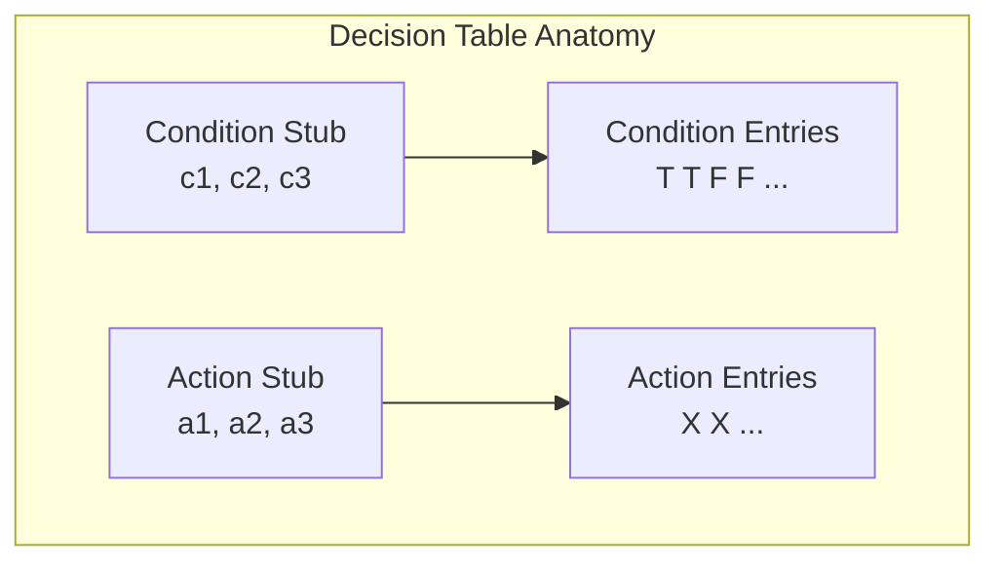

# Lecture 09 — Decision Table–Based Testing

## 📌 Overview

[[Decision Table Testing]] is the **most rigorous** specification-based method due to its strong logical basis. Decision tables have been used since the early 1960s to represent and analyse complex logical relationships. They are ideal for situations where a number of combinations of actions are taken under varying sets of conditions.

---

## 1 · Decision Tables

### Structure

A decision table has **four portions**:

| | **Stub Portion** (left) | **Entry Portion** (right) |
|---|---|---|
| **Condition Portion** (top) | Condition stub | Condition entries |
| **Action Portion** (bottom) | Action stub | Action entries |

### Rule

A **rule** is a column in the entry portion. Rules indicate which actions (if any) are taken for the circumstances indicated in the condition portion.

**Example:** When c1 and c2 are both true and c3 is false → actions a1 and a3 occur.

### Don't Care Entries

The `—` (don't care) entry means:
- The condition is **irrelevant**, or
- The condition does **not apply**

### Binary Conditions

When conditions are binary (true/false, yes/no, 0/1), the condition portion of a decision table is a **truth table** rotated 90°. This structure guarantees we consider **every possible combination** of condition values — a form of **complete testing**.

### Types of Decision Tables

| Type | Description |
|------|-------------|
| **Limited Entry (LEDT)** | All conditions are **binary** |
| **Extended Entry (EEDT)** | Conditions can have **several values** |

### Declarative Nature

Decision tables are **deliberately declarative** (NOT imperative):
- No particular order is implied by the conditions
- Selected actions do **not** occur in any particular order

---

## 2 · Decision Table Techniques

### How to Identify Test Cases

1. Take **conditions** as **inputs** and **actions** as **outputs**
2. Conditions may refer to **equivalence classes** of inputs
3. Actions refer to **major functional processing** portions
4. Take **rules** as **test cases**

### Triangle Problem Decision Table

The decision table can mechanically be forced to be **complete** → provides a comprehensive set of test cases.

A helpful style is to add an **"impossible" action** to show when a rule is logically impossible.

### Mutually Exclusive Conditions

When conditions refer to equivalence classes that are mutually exclusive (e.g., month classes in NextDate), we cannot ever have a rule in which two entries are true. The don't care entries mean "must be false."

### Rule Count

For an LEDT with $n$ conditions, there must be **$2^n$ independent rules**:
- Rules with **no don't care** entries count as **one rule**
- Each **don't care** entry in a rule **doubles** the count of that rule

---

## 3 · Inconsistent and Redundant Decision Tables

| Problem | Description |
|---------|-------------|
| **Inconsistent** | Two rules with the same condition entries but **different action entries** → the table is **non-deterministic** |
| **Redundant** | Two rules with the same condition entries and the **same action entries** → less problematic, but still indicates poor design |

> [!warning] Tester Responsibility
> Testers should **care when don't care entries** are used in a decision table. Inconsistent rules mean the behaviour is undefined.

---

## 4 · Practice: ShoppingDiscount

| Attribute | Details |
|-----------|---------|
| **Function** | `ShoppingDiscount` |
| **Inputs** | Membership (Regular/Premium), Purchase Amount (> 100,000 IQD / ≤ 100,000 IQD), Coupon (Yes/No) |
| **Output** | Discount (0%, 15%, 20%, 25%) |

### Discount Logic

| Condition | Discount |
|-----------|----------|
| Premium member (base) | 15% |
| Purchase > 100,000 IQD | +20% |
| Using a coupon | +5% |
| Regular + under 100K + no coupon | 0% |
| **Maximum cap** | **25%** |

> [!example] Task
> Design test cases using the decision table–based approach.

---

## 5 · Key Takeaways

1. Decision tables are the **most rigorous** specification-based method due to their logical basis
2. **LEDT**: binary conditions; **EEDT**: multi-value conditions
3. Each **rule** in a decision table → one **test case**
4. Mutually exclusive conditions require careful handling of don't care entries
5. **Inconsistent** tables are non-deterministic; **redundant** tables have duplicate rules
6. The completeness property of decision tables guarantees a form of **complete testing**

---

## 📚 References

- Jorgensen, P. C. (2014). *Software Testing and Analysis, A Craftsman's Approach*. CRC Press. **Chapter 7.**
- Ammann, P. & Offutt, J. (2008). *Introduction to Software Testing*. Cambridge University Press.
- Myers, G. J. (2012). *The Art of Software Testing*. John Wiley & Sons.
- Pezzè, M. & Young, M. (2008). *Software Testing and Analysis: Process, Principles, and Techniques*. Wiley.

---

← [[Lecture 08 - ECT Examples and Edge Testing]] | [[Intro to Software Testing MOC]] | [[Lecture 10 - Decision Tables Continued]] →
