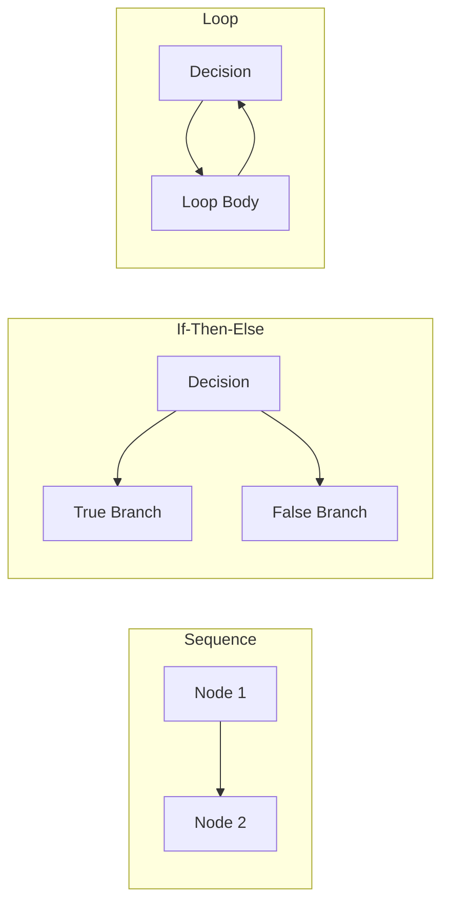

# Lecture 11 — Path Testing & DD-Paths

## 📌 Overview

This lecture marks the transition from [[Specification-Based Testing|specification-based]] to **[[Structural Testing|code-based (structural) testing]]**. Path testing uses **[[Program Graph]]s** as the foundation for rigorous test coverage metrics. The centrepiece is the **[[DD-Path]] (Decision-to-Decision Path)** concept, which enables precise descriptions of test coverage.

---

## 1 · Program Graphs

### Definition

> [!definition] Program Graph
> Given a program written in an imperative language, its **program graph** is a directed graph in which **nodes** are **statement fragments** and **edges** represent **flow of control**.

If $i$ and $j$ are nodes, an edge exists from $i$ to $j$ iff the statement fragment at $j$ can be executed **immediately after** the statement fragment at $i$.

### Structured Programming Constructs



### Key Properties

| Property | Description |
|----------|-------------|
| **Source node** | Node with indegree = 0 (entry point) |
| **Sink node** | Node with outdegree = 0 (exit point) |
| **Acyclic graph** | No loops → no cycles |
| **Single entry, single exit** | Structured programming ideal |

### Statement Fragment

What constitutes a statement fragment is a matter of **style choice**. Sometimes a fragment is kept as a separate node; sometimes it is better to include it with another portion of a statement.

---

## 2 · The Impossibility of Complete Path Testing

A graph of a simple (but unstructured!) program can have **5 paths** leading from one node to another in the interior of a loop. If the loop may have up to **18 repetitions**, some **~4.77 trillion** distinct program execution paths exist.

> [!warning] Logical Fallacy of Extension
> This is why exhaustive path testing is **impossible** — and why we need **coverage metrics** to determine what constitutes sufficient testing.

---

## 3 · DD-Paths (Decision-to-Decision Paths)

### Definition

> [!definition] DD-Path
> A **Decision-to-Decision path** is a sequence of statements that begins with the "outway" of a decision statement and ends with the "inway" of the next decision statement. **No internal branches** occur in such a sequence.

The corresponding code resembles a **row of dominoes** — when the first falls, all the rest in the sequence fall.

### Modern Languages

For modern programming languages, DD-paths are similar to code **blocks** (e.g., code between `{}` in Java).

### Formal Definition (Based on Graph Theory)

DD-paths are defined in terms of **chains** in a program graph:

> [!definition] Chain
> A path in which the initial and terminal nodes are distinct, and every interior node has indegree = 1 and outdegree = 1.

### Five Cases for DD-Path Nodes

| Case | Description | Meaning |
|------|-------------|---------|
| **1** | Single node with indegree = 0 | **Source** DD-path (entry) |
| **2** | Single node with outdegree = 0 | **Sink** DD-path (exit) |
| **3** | Single node with indegree ≥ 2 or outdegree ≥ 2 | **Complex node** (decision/junction) |
| **4** | Single node with indegree = 1 and outdegree = 1 | **Short branch** node |
| **5** | Maximal chain of length ≥ 1 | **Normal** DD-path (a "domino row") |

No node belongs to more than one DD-path.

---

## 4 · DD-Path Graph (Control Flow Graph)

### Definition

> [!definition] DD-Path Graph
> Given a program, its **DD-path graph** is the directed graph in which:
> - **Nodes** are DD-paths of its program graph
> - **Edges** represent control flow between successor DD-paths

This is essentially the **Control Flow Graph (CFG)**.

### Example: Triangle Program

In the triangle program:
- **Node 4** is a Case 1 DD-path (source)
- **Node 23** is a Case 2 DD-path (sink)
- **Nodes 5–8** form a Case 5 DD-path (maximal chain)
- **Nodes 10, 11, 15, 17, 18, 21** are Case 4 (short branches)
- **Nodes 9, 12, 13, 14, 16, 19, 20, 22** are Case 3 (complex nodes)

### How to Derive a DD-Path Graph

The process is straightforward but may require some judgment (based on experience). The **last statement in a segment** must be:
- A **predicate**
- A **loop control**
- A **break**
- A **method exit**

---

## 5 · Test Coverage Metrics

### Purpose

> [!definition] Test Coverage Metrics
> A **device to measure** the extent to which a set of test cases covers (or exercises) a program. Given a program graph, we can define a set of metrics.

### Node Coverage ($G_{node}$)

A set of test cases such that when executed, **every node is traversed**.

- Guarantees every **statement fragment** is executed
- Careful definition of fragments ensures decision outcomes are executed

### Edge Coverage ($G_{edge}$)

A set of test cases such that when executed, **every edge** is traversed.

- With $G_{edge}$, we are certain that **all outcomes** of a decision-making statement are executed
- More thorough than $G_{node}$

### Chain Coverage ($G_{chain}$)

Every chain of length ≥ 2 is traversed. Equivalent to node coverage.

### Path Coverage ($G_{path}$)

Every path from the source node to the sink node is traversed.

> [!warning] Severe Limitation
> Path coverage is open to **severe limitations** when there are loops. Every loop is a set of **strongly (3-connected) nodes**.

**Solution:** Exercise every loop, then form the **condensation graph** (directed acyclic graph).

---

## 6 · Miller's Test Coverage Metrics

### Versions

| Version A | Version B | Version C |
|-----------|-----------|-----------|
| Statement Coverage ($C_0$) | Statement Coverage | Chillenski |
| DD-Path Coverage ($C_1$) | Decision Coverage | |
| Branch Coverage ($C_1p$) | Condition Coverage | |
| Simple Loop Coverage ($C_2$) | Multiple Decision-Condition Coverage | |
| Complex Loop Coverage ($C_{ik}$) | | |
| Multiple Condition Coverage ($C_{MCC}$) | | |
| "Statistically Significant" ($C_{stat}$) | | |
| All Possible Paths ($C_\infty$) | | |

### Statement Testing ($C_0$)

Generally viewed as the **bare minimum**. If some statements have not been executed, there is clearly a severe gap in test coverage. Still widely accepted and mandated by **ANSI Standard 187B**.

### DD-Path Coverage ($C_1$)

Traversing every edge in the DD-path graph → each predicate outcome is executed. For `if–then–else`, both true and false branches are covered.

### Simple Loop Coverage ($C_2$)

DD-path coverage + loop testing. Every loop involves a decision — we need to test both outcomes:
- Traverse the loop
- Exit (or not enter) the loop

Equivalent to **$G_{edge}$** test coverage.

### Dependent Pairs of DD-Paths

The most common dependency is the **define/reference relationship** — a variable is defined in one DD-path and referenced in another. These dependencies are closely related to the problem of **infeasible paths**.

> [!example] Triangle Program
> The variable `IsATriangle` is set to `TRUE` at node C and `FALSE` at node D. Node H is the branch taken when `IsATriangle` is TRUE. Any path containing nodes **D and H** is **infeasible**.

### Complex Loop Coverage ($C_{ik}$)

Extends loop coverage to full paths containing loops:

| Loop Type | Description |
|-----------|-------------|
| **Concatenated** | One loop after another |
| **Nested** | One loop inside another |
| **Knotted** | One loop tampers with another's index (e.g., a `try/catch` inside a loop modifying the loop variable) |

**Testing approach:** Take a modified BVT approach — loop index at minimum, nominal, and maximum values. Test innermost loops first and work outward.

### Multiple Condition Coverage ($C_{MCC}$)

Addresses testing decisions made by **compound conditions**:
- Make a **decision table** — a compound condition of $n$ simple conditions has $2^n$ rules
- Or **reprogram** compound predicates into **nested if–then–else** logic

> [!important] Important Trade-off
> Statement complexity vs. path complexity. You cannot neglect complexity by satisfying DD-path coverage alone.

### MCDC (Modified Condition Decision Coverage)

A refinement of Multiple Condition Coverage. Each condition must be shown to **independently affect** the decision outcome.

---

## 7 · Practice

> [!example] Task
> 1. Draw the **Program Graph** for the following program segment
> 2. Rewrite the segment with compound conditions replaced by **nested if–then–else**
> 3. Draw the **Program Graph** for the modified version
> 4. Compare the two graphs — which is more complex?
>
> ```
> If (a = b) AND (b = c)
>     Output ("Equilateral")
> Else If (a ≠ b) AND (a ≠ c) AND (b ≠ c)
>     Output ("Scalene")
> Else
>     Output ("Isosceles")
> ```

---

## 8 · Key Takeaways

1. **Program graphs** are directed graphs with nodes as statement fragments and edges as control flow
2. **DD-Paths** are sequences from one decision to the next — five cases define them formally
3. **DD-path graphs** (CFGs) enable precise coverage metrics
4. **Coverage metrics** from $C_0$ (statement) to $C_\infty$ (all paths) form a hierarchy
5. **Dependent DD-path pairs** reveal infeasible paths and deeper faults
6. **Compound conditions** require multiple condition coverage — simple DD-path coverage alone is insufficient

---

## 📚 References

- Jorgensen, P. C. (2014). *Software Testing and Analysis, A Craftsman's Approach*. CRC Press. **Chapter 8.**
- Ammann, P. & Offutt, J. (2008). *Introduction to Software Testing*. Cambridge University Press.
- Myers, G. J. (2012). *The Art of Software Testing*. John Wiley & Sons.
- Pezzè, M. & Young, M. (2008). *Software Testing and Analysis: Process, Principles, and Techniques*. Wiley.

---

← [[Lecture 10 - Decision Tables Continued]] | [[Intro to Software Testing MOC]] | [[Lecture 12 - Basis Path Testing and Cyclomatic Complexity]] →
