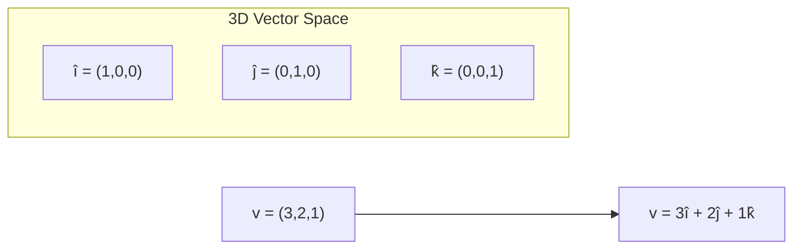
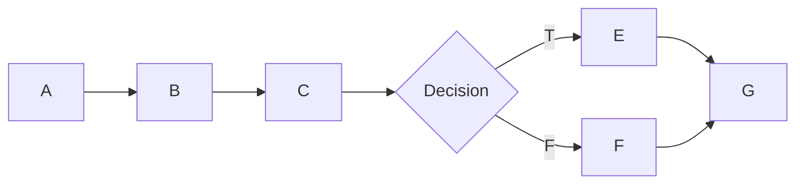

# Lecture 12 — Basis Path Testing & Cyclomatic Complexity

## 📌 Overview

This lecture presents **[[Basis Path Testing]]**, Thomas McCabe's method for identifying a **basis set** of linearly independent program paths using [[Cyclomatic Complexity]]. It also covers **[[Essential Complexity]]**, **unstructured programming constructs**, and practical **guidelines** for using coverage metrics.

---

## 1 · Basis Path Testing

### The Mathematical Underpinning

In mathematics, a **basis** is a set of elements in a **vector space** such that:
1. **Every element** in the space can be expressed as a combination of basis elements
2. If one basis element is removed, this representation property is **lost**



Just as any vector can be represented using basic unit vectors, any program execution path can be represented using a **basis set of independent paths**.

### The Testing Application

If we can view a program as a vector space, then the **basis** would be a very interesting set of elements to test. **If the basis paths are okay**, we could hope that everything expressible in terms of the basis is also okay.

Thomas McCabe recognized this possibility in the **mid-1970s**.

---

## 2 · McCabe's Basis Path Method

### Cyclomatic Number

> [!definition] Cyclomatic Number
> The cyclomatic number $V(G)$ of a **strongly connected** directed graph is the **number of linearly independent circuits** in the graph.

$$V(G) = e - n + p$$

Where:
- $e$ = number of **edges** in $G$
- $n$ = number of **nodes** in $G$
- $p$ = number of **components** in $G$

### Cyclomatic Complexity

For a program graph, the cyclomatic complexity can be computed as:

$$V(G) = e - n + 2$$

(for a single-entry, single-exit program graph that is NOT strongly connected — add 2 instead of $p$).

### Strongly Connected Graphs

A directed graph is **strongly connected** if there is a path between every two nodes. We can always create a strongly connected graph by adding an edge from the sink node to the source node.

If the single-entry, single-exit precept is violated, we greatly increase the cyclomatic number.

### Example

For a graph with $e = 10$, $n = 7$:
$$V(G) = 10 - 7 + 2(1) = 5$$

This means there are **5 linearly independent paths**.



### Independent Paths (Example)

| Path | Edge Traversal |
|------|----------------|
| p1: A, B, C, G | 1-2-3-4 |
| p2: A, B, C, B, C, G | 1-2-3-2-3-4 |
| p3: A, B, E, F, G | 1-5-6-7-4 |
| p4: A, D, E, F, G | 1-8-6-7-4 |
| p5: A, D, F, G | 1-8-9-4 |

### Observations (Triangle Example)

1. Start with a **baseline path** (e.g., scalene triangle 3, 4, 5)
2. **Flip the decision** at one predicate node → get the next path
3. Continue flipping decisions in the baseline path
4. The result is a set of **linearly independent basis paths**

> [!note] Basis path testing gives a **lower boundary** on how much testing is necessary.

---

## 3 · Essential Complexity

### Concept

Part of McCabe's work on cyclomatic complexity does more to improve **programming** than testing:

1. Look for the graph of a **structured programming construct**
2. **Collapse** it into a single node
3. **Repeat** until no more structured constructs can be found

### The Result

- If the unit is **well structured**, its essential complexity is **1** → it can be simplified easily
- If essential complexity > 1, there are **structured programming violations**

---

## 4 · Unstructures (Structured Programming Violations)

Each violation contains **three** distinct paths, as opposed to the **two** paths present in the corresponding structured construct.

### Implications

| Finding | Action |
|---------|--------|
| High cyclomatic complexity | Needs more testing |
| $V(G) \geq 10$ (common threshold) | Simplify or plan more testing |
| Essential complexity = 1 | Well structured; can be simplified |
| Essential complexity > 1 | Best to eliminate violations |

### Bottom Line

Programs with high cyclomatic complexity **require more testing**. Most organizations set a guideline of $V(G) \leq 10$.

---

## 5 · Guidelines and Observations

### The Pendulum Context

In [[Specification-Based Testing]], gaps and redundancies can exist without being recognized. Path testing represents the pendulum swinging **too far the other way** — obscuring important information (feasible vs. infeasible paths).

### What Code-Based Testing Cannot Do

> [!important] Limitation
> No form of code-based testing can reveal **missing functionality** that is specified in the requirements.

### McCabe's Warning

> "It is important to understand that these are purely criteria that **measure the quality of testing**, and not a procedure to identify test cases."

### Using Coverage Metrics as a Crosscheck

Path-based testing helps find metrics that act as **crosschecks** on specification-based testing:

- Same program path traversed by several functional TCs → **redundancy**
- Failure to attain DD-path coverage → **gaps** in functional TCs

### Example

If a program has extensive **error handling**, and we test with normal BVT (all valid values), DD-paths for error-handling code will **not be traversed**. Adding robust/equivalence class TCs improves coverage.

### Selective Coverage

Coverage metrics can operate in two ways:
1. **Blanket-mandated standard** — e.g., "all units shall attain full DD-path coverage"
2. **Selective mechanism** — more rigorous coverage for complex modules, simpler coverage for straightforward ones

> [!tip] Best View of Structural Testing
> Use the **properties of the source code** to identify appropriate coverage metrics, then use these as a **crosscheck** on functional test cases. When desired coverage is not attained, follow interesting paths to identify **additional special value test cases**.

---

## 6 · Practice

> [!example] Task
> 1. Find **basis paths** for the following program
> 2. Can you use those paths for designing test cases?
> 3. Do you need [[Specification-Based Testing]] concepts for test case design?
>
> ```js
> function lec12(x, y) {
>     if (x > 0) {
>         if (y > 0) {
>             return x * y;
>         } else {
>             return x + y;
>         }
>     } else {
>         return x / y;
>     }
> }
> ```

---

## 7 · Key Takeaways

1. **Basis path testing** uses the mathematical notion of a basis from vector spaces
2. McCabe's method uses the **cyclomatic number** $V(G) = e - n + p$ to determine the number of linearly independent paths
3. **Essential complexity** > 1 indicates unstructured code that needs simplification
4. $V(G) \geq 10$ is a common threshold requiring either simplification or more testing
5. Coverage metrics serve as **crosschecks** on functional test cases
6. Code-based testing **cannot reveal missing functionality** in requirements
7. The **best practice**: combine structural and functional approaches

---

## 📚 References

- Jorgensen, P. C. (2014). *Software Testing and Analysis, A Craftsman's Approach*. CRC Press. **Chapter 8.**
- Ammann, P. & Offutt, J. (2008). *Introduction to Software Testing*. Cambridge University Press.
- Myers, G. J. (2012). *The Art of Software Testing*. John Wiley & Sons.
- Pezzè, M. & Young, M. (2008). *Software Testing and Analysis: Process, Principles, and Techniques*. Wiley.

---

← [[Lecture 11 - Path Testing and DD-Paths]] | [[Intro to Software Testing MOC]] | [[Lecture 13 - Data Flow Testing]] →
