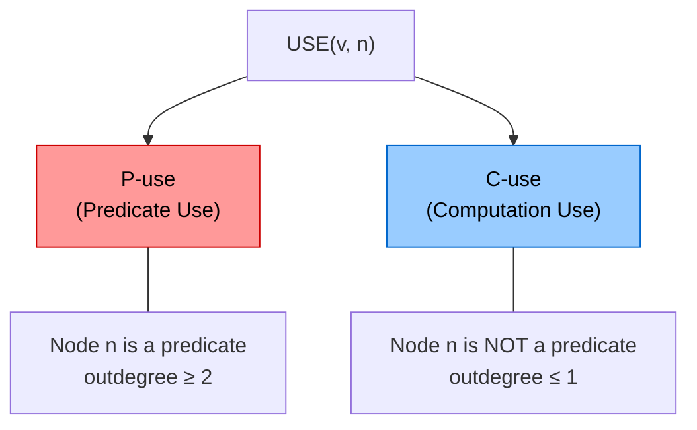
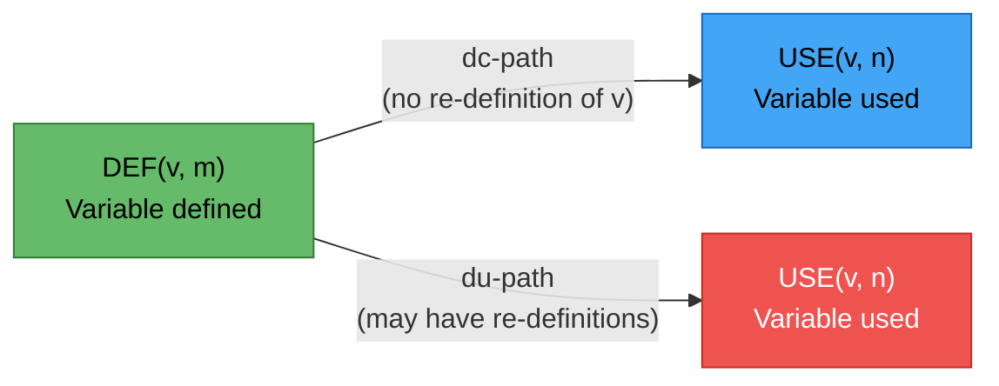
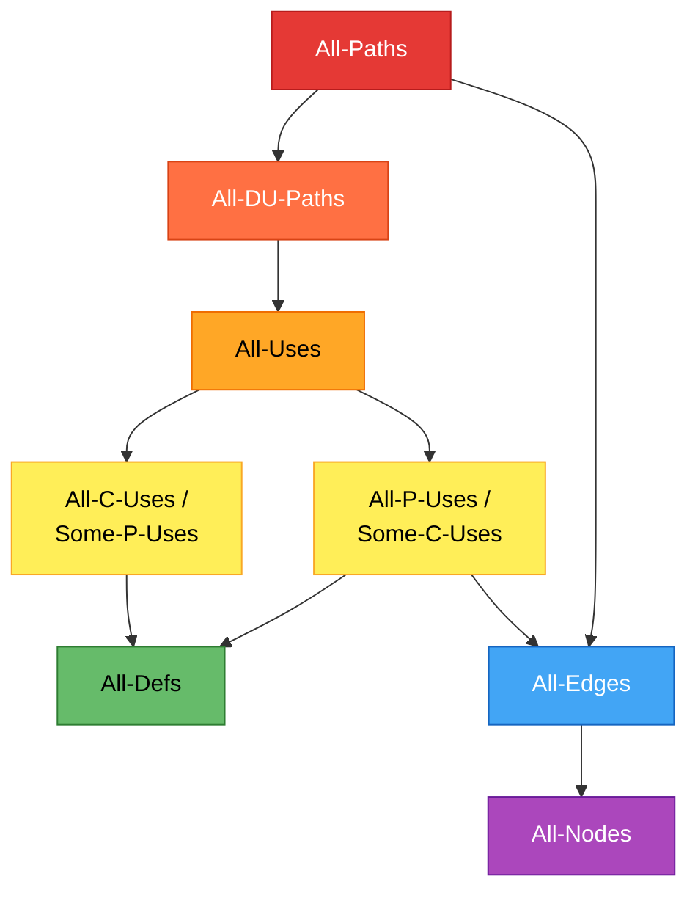

# Lecture 13 — Data Flow Testing

## Overview

> [!important] Not Data Flow Diagrams!
> Data flow testing has **nothing to do with Data Flow Diagrams (DFDs)**. It is a form of [[Structural Testing]] (code-based testing).

Data flow testing focuses on two things:
1. The **points at which variables receive values** (are *defined*)
2. The **points at which those values are used** (are *referenced*)

It serves as a **"reality check"** on [[Path Testing]] — many data flow testing proponents see this approach as a form of path testing. While data flow and [[Program Slicing|slice-based testing]] are cumbersome at the [[Unit Testing]] level, they are **well suited for object-oriented code**.

### Two Mainline Forms

| Form | Description |
|------|-------------|
| **Define/Use Testing** | A set of basic definitions and a unifying structure of [[Test Coverage Metrics]] |
| **Slice-Based Testing** | Based on the concept of a [[Program Slicing\|program slice]] |

Both forms:
- Formalize **intuitive behaviors** of testers
- Start with a [[Program Graph]] and move back toward [[Specification-Based Testing|functional testing]]
- Are **difficult to perform manually** — few commercial tools exist
- Are helpful for **coding and debugging**

## Define/Reference Anomalies (Static Analysis)

Most programs deliver functionality in terms of data — variables receive values and those values are used to compute values for other variables. Early data flow analyses centered on **define/reference anomalies**:

| Anomaly | Description |
|---------|-------------|
| **Defined but never used** | A variable is assigned a value but never referenced |
| **Used before defined** | A variable is accessed before it receives a value |
| **Defined twice before used** | A variable is assigned a value twice before any reference |

Each of these anomalies can be recognized from the **concordance** of a program. Because concordance information is compiler-generated, these anomalies can be discovered by **[[Static Analysis]]** — finding faults in source code **without executing it**. Modern IDEs can detect these automatically.

## Define/Use (DefUse) Testing

### Program Graph Assumptions

The program has a [[Program Graph]] $G(P)$ with a set of variables $V$, following structured programming precepts:

- **Single-entry node** and **single-exit node**
- Self-loops (edges from a node to itself) are **not allowed**
- Paths, subpaths, and cycles are defined as before
- $PATHS(P)$ represents the set of all paths in $P$

### Core Definitions

> [!definition] DEF(v, n) — Defining Node
> Node $n \in G(P)$ is a **defining node** for variable $v \in V$ iff the value of $v$ is **defined** at the statement fragment corresponding to node $n$. This is where a variable is **assigned a value**.

> [!definition] USE(v, n) — Usage Node
> Node $n \in G(P)$ is a **usage node** for variable $v \in V$ iff the value of $v$ is **used** at the statement fragment corresponding to node $n$. This is where a variable's value is **accessed**.

### P-Use vs C-Use



| Type | When? | Outdegree |
|------|-------|-----------|
| **P-use** (Predicate use) | Node $n$ is a **predicate** (decision point) | $\geq 2$ |
| **C-use** (Computation use) | Node $n$ is **not** a predicate | $\leq 1$ |

### du-paths and dc-paths

> [!definition] du-path (Definition-Use Path)
> A path in $PATHS(P)$ with $DEF(v, m)$ at the initial node $m$ and $USE(v, n)$ at the final node $n$, for some variable $v \in V$.

> [!definition] dc-path (Definition-Clear Path)
> A du-path in $PATHS(P)$ from $DEF(v, m)$ to $USE(v, n)$ in which **no intermediate node $k$ redefines $v$** — i.e., there is no other $DEF(v, k)$ along the path.



### Key Insights

- du-paths and dc-paths describe the **flow of data** across source statements from points where values are **defined** to points where values are **used**
- **du-paths that are NOT definition-clear** are potential trouble spots — the variable may have been redefined unexpectedly
- Using du-paths, you can identify points for **variable "watches"** and **breakpoints** in an IDE

### Commission Problem Example

The Commission problem is used to illustrate define/use paths:

1. Identify the **program graph** and **DD-path graph** of the commission problem pseudocode
2. For each variable (e.g., `locks`, `stocks`, `barrels`, `totalLocks`, `commission`):
   - List all **DEF nodes** and **USE nodes**
   - Enumerate all **du-paths**
   - Determine which are **dc-paths** (definition-clear)
3. Build a table of **Define/Use Nodes for Variables**
4. Select **Define/Use Paths** for testing

## Test Coverage Metrics (Rapps–Weyuker Hierarchy)

We analyze a program with definition/use paths to define a set of [[Test Coverage Metrics]], known as the **Rapps–Weyuker data flow metrics**.

### Relationship to Miller's Metrics

The first three are equivalent to three of Miller's metrics from [[Path Testing]]:
- **All-Paths**
- **All-Edges**
- **All-Nodes**

The remaining metrics presume that define and usage nodes have been identified for all program variables, and that du-paths have been identified with respect to each variable.

> [!warning] Feasibility
> It is **not enough** to take the cross product of DEF nodes with USE nodes for a variable to define du-paths. This mechanical approach can result in **infeasible paths**. We assume that the define/use paths are all **feasible**.

### Definitions

In the following, $T$ is a set of paths in the [[Program Graph]] $G(P)$ of a program $P$ with the set $V$ of variables:

> [!definition] All-Defs
> $T$ satisfies **All-Defs** iff for every variable $v \in V$, $T$ contains definition-clear paths from **every defining node** of $v$ to **a use** of $v$.

> [!definition] All-Uses
> $T$ satisfies **All-Uses** iff for every variable $v \in V$, $T$ contains definition-clear paths from **every defining node** of $v$ to **every use** of $v$, and to the **successor node** of each $USE(v, n)$.

> [!definition] All-P-Uses/Some-C-Uses
> $T$ satisfies this iff for every variable $v \in V$, $T$ contains definition-clear paths from every defining node of $v$ to **every predicate use** of $v$; and if a definition of $v$ has **no P-uses**, a definition-clear path leads to **at least one computation use**.

> [!definition] All-C-Uses/Some-P-Uses
> $T$ satisfies this iff for every variable $v \in V$, $T$ contains definition-clear paths from every defining node of $v$ to **every computation use** of $v$; and if a definition of $v$ has **no C-uses**, a definition-clear path leads to **at least one predicate use**.

> [!definition] All-DU-Paths
> $T$ satisfies **All-DU-Paths** iff for every variable $v \in V$, $T$ contains definition-clear paths from every defining node of $v$ to **every use** of $v$ and to the successor node of each $USE(v, n)$, and these paths are either **single loop traversals** or **cycle-free**.

### Rapps–Weyuker Hierarchy

Define/use testing provides a rigorous, systematic way to examine points at which faults may occur. The metrics form a hierarchy of increasing strength:



**Reading the hierarchy:** An arrow from A → B means "A subsumes B" (A is stronger — satisfying A guarantees satisfying B).

## Slice-Based Testing

> [!definition] Program Slice
> A **program slice** is a set of program statements that **contributes to, or affects the value of**, a variable at some point in a program.

The concept of [[Program Slicing]] goes back to the early 1980s. It took about **20 years** to move this seminal idea into industrial practice. The notion of a slice corresponds to other disciplines as well — compare the idea with the way we study other disciplines (isolating relevant factors).

### Program Slicing Tools

Program slicing is **not a viable manual approach** — while it has its place, the actual learning benefit is not substantial for manual work.

| Characteristic | Details |
|---------------|---------|
| **Tool maturity** | Most slicing tools are either academic or experimental |
| **Commercial tools** | Few exist |
| **Advanced features** | More elaborate tools feature **interprocedural slicing**, useful for large systems |
| **Market use** | Much of the market uses program slicing to improve **program comprehension** for maintenance programmers |
| **OO support** | **JSlice** is appropriate for object-oriented software |

## Practice: CalcNetAmount

Consider the following function and apply data flow testing:

```java
1  CalcNetAmount(double purchaseAmnt, int customerType, int loyaltyYears) {
2      double discount = 0;
3
4      if (purchaseAmnt > 100) {
5          discount = 0.05; }
6
7      if (customerType == 1) {
8          discount += 0.05; }
9
10     if (loyaltyYears > 5) {
11         discount += 0.05; }
12
13     return (purchaseAmnt * (1 - discount));
14  }
```

### Tasks

1. **List DEFs** — identify all defining nodes for each variable
2. **List USEs** — identify all usage nodes (P-use vs C-use) for each variable
3. **List du-paths** — enumerate all definition-use paths
4. **Devise [[Test Case|test cases]]** based on du-paths

### Analysis Hints

| Variable | DEF Nodes | USE Nodes | Use Type |
|----------|-----------|-----------|----------|
| `purchaseAmnt` | 1 (parameter) | 4 (P-use), 13 (C-use) | Both |
| `customerType` | 1 (parameter) | 7 (P-use) | P-use |
| `loyaltyYears` | 1 (parameter) | 10 (P-use) | P-use |
| `discount` | 2, 5, 8, 11 | 5 (C-use), 8 (C-use), 11 (C-use), 13 (C-use) | C-use |

---
← [[Lecture 12 - Path Testing]] | [[Intro to Software Testing MOC]] | [[Lecture 14 - Integration Testing]] →
