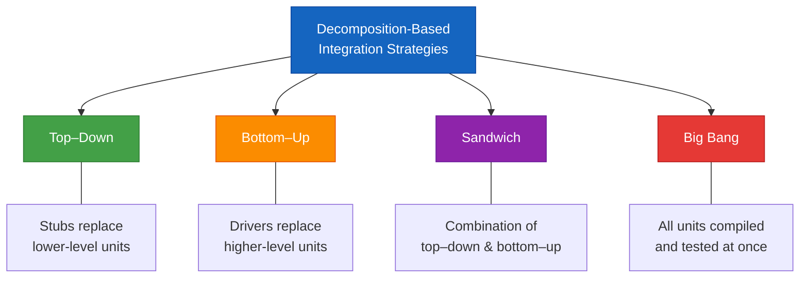
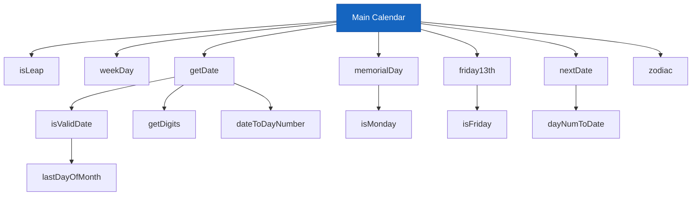
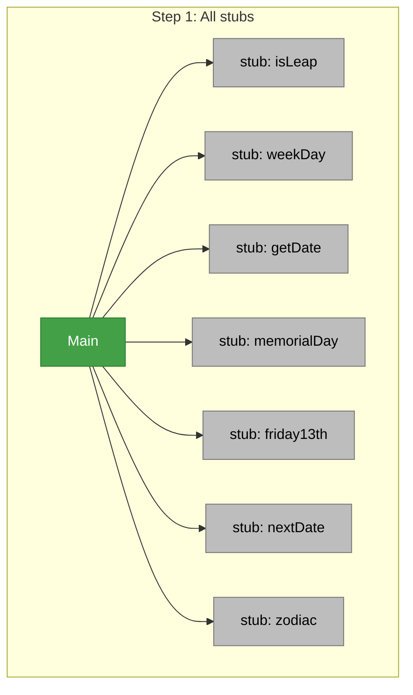

# Lecture 14 — Integration Testing

## Overview

### The Mars Climate Orbiter Failure

> [!warning] Real-World Failure — September 1999
> The **Mars Climate Orbiter** mission failed after successfully traveling **416 million miles in 41 weeks**. It disappeared just as it was to begin orbiting Mars.
>
> **The fault should have been revealed by [[Integration Testing]]:**
> - **Lockheed Martin Astronautics** used acceleration data in **English units (pounds)**
> - The **Jet Propulsion Laboratory** did its calculations with **metric units (newtons)**
>
> NASA announced a **$50,000 project** to discover how this could have happened.

This is a textbook example of an **interface mismatch** — exactly what integration testing is designed to catch.

### Integration Testing in Context

Of the three distinct levels of software testing — [[Unit Testing]], [[Integration Testing]], and [[System Testing]] — integration testing is the **least well understood**. Therefore, in practice, it is the phase **most poorly done**.

> [!tip] How Craftspersons Are Recognized
> They have two essential characteristics:
> 1. A **deep knowledge of the tools** of their trade
> 2. A similar **knowledge of the medium** in which they work
>
> So they understand their tools in terms of how they work with the medium.

## Decomposition-Based Integration

Mainline introductory software engineering texts typically present **four integration strategies** based on the [[Functional Decomposition Tree]] of procedural software:



### Key Assumptions

- The [[Functional Decomposition Tree]] is the basis for integration testing — it is the main representation, usually derived from final source code
- It shows the **structural relationship** of the system with respect to its units
- All integration orders presume that the **units have been separately tested**
- The goal is to **test the interfaces** among separately tested units

### The Functional Decomposition Tree

A functional decomposition tree reflects the **lexicological inclusion** of units — the order in which they need to be compiled to assure the correct referential scope of variables and unit names.

## Calendar Program Example

The familiar NextDate unit is extended to a main program, **Calendar**, with procedures and functions:

```
Main Calendar
├── Function isLeap
├── Procedure weekDay
├── Procedure getDate
│   ├── Function isValidDate
│   │   └── Function lastDayOfMonth (uses isLeap)
│   ├── Procedure getDigits (uses isValidDate)
│   └── dateToDayNumber
├── Procedure memorialDay
│   └── Function isMonday (uses weekDay)
├── Procedure friday13th
│   └── Function isFriday (uses weekDay)
├── Procedure nextDate
│   └── Procedure dayNumToDate (uses isLeap)
└── Procedure zodiac
```



The main program body calls: `getDate` → `nextDate` → `weekDay` → `zodiac` → `memorialDay` → `friday13th`.

## Top–Down Integration

### How It Works

1. Start at the **root** of the [[Functional Decomposition Tree]] (Main program)
2. Replace all lower-level units with **stubs**
3. Test the main program functionality
4. **Replace one stub at a time**, leaving the others as stubs
5. Proceed in a **breadth-first traversal** of the decomposition tree until all stubs are replaced

> [!definition] Stub
> A piece of **throwaway code** that emulates a called unit. The tester **hard codes** it to respond correctly to the request from the calling/invoking unit.

**Example:** When Calendar main calls `zodiacStub` with May 27, 2012, the stub would return "Gemini." In extreme practice, the response might be *"pretend zodiac returned Gemini."*

### The Theory

As stubs are replaced one at a time, **if there is a problem, it must be with the interface to the most recently replaced stub**.

### The Problem

The functional decomposition is **deceptive**. Because it is derived from the lexicological inclusion required by most compilers, the process generates **impossible interfaces**.

> [!warning] Impossible Test Sessions
> Calendar main **never directly refers** to either `isLeap` or `weekDay`, so those test sessions (Main ↔ isLeap, Main ↔ weekDay) **could not occur** even though the tree suggests they should.



## Bottom–Up Integration

### How It Works

Bottom–up integration is a **"mirror image"** of the top–down order:

1. Start at the **leaves** of the decomposition tree
2. Use a **driver** version of the unit that would normally call it to provide test cases
3. As units are tested, **drivers are gradually replaced** until the full decomposition tree has been traversed

> [!definition] Driver
> Code that **emulates units at the next level up** in the tree. Similar to test driver units at the [[Unit Testing]] level.

**Example:** For zodiac, the Calendar driver would call zodiac with **36 test dates** — the day before a cusp date, the cusp date, and the day after the cusp date. For Gemini (cusp May 21): call with May 20, May 21, May 22. Expected: "Taurus," "Gemini," "Gemini."

### Comparison with Top–Down

- **Less throwaway code** exists in bottom–up integration
- But the **problem of impossible interfaces persists**

## Sandwich Integration

Sandwich integration is a **combination** of top–down and bottom–up integration. If we think about it in terms of the decomposition tree, we are really only doing **big bang integration on a subtree**.

> [!definition] Sandwich
> A **full path from the root to leaves** of the [[Functional Decomposition Tree]].

### Characteristics

- **Less stub and driver development effort** — but offset by added difficulty of fault isolation (consequence of big bang on the subtree)
- **No stubs nor drivers** are needed in sandwich integration
- The **fault isolation capability** of top–down and bottom–up approaches is **sacrificed**
- Sandwiches can vary in size — from "dainty finger sandwiches" to "Dagwood-style sandwiches"

**Example:** A sandwich containing `Main → getDate → isValidDate → lastDayOfMonth` is almost semantically coherent, except that `isLeap` is missing. This set could be meaningfully integrated, but test cases at the end of February would not be covered.

## Big Bang Integration

> [!danger] Big Bang
> All the units are **compiled together and tested at once**. When (not if!) a failure is observed, **few clues are available** to help isolate the location(s) of the fault.

Recall the distinction between [[Fault|faults]] and [[Failure|failures]].

## Pros and Cons

### Advantages of Decomposition-Based Integration

- With the exception of big bang, the approaches are all **intuitively clear**:
  - Build with tested components
  - See a failure → suspect the most recently added unit
- Integration testing progress is **easily tracked** against the decomposition tree
- If the tree is small, you can **shade in nodes** as they are successfully integrated
- Top–down and bottom–up suggest breadth-first traversals, but this is **not mandatory** — you could use full-height sandwiches for **depth-first** traversal

### Disadvantages

| Issue | Explanation |
|-------|-------------|
| **Artificial structure** | Functional decomposition and waterfall development are artificial; they serve project management more than developers |
| **Structural assumption** | Units are integrated with respect to structure; this presumes correct behavior follows from individually correct units and correct interfaces — **practitioners know better** |
| **Throwaway code** | Development effort for stubs/drivers, compounded by retesting effort |
| **Impossible interfaces** | The decomposition tree may suggest test pairs that **cannot actually occur** at runtime |

### Summary Comparison

| Strategy | Stubs? | Drivers? | Fault Isolation | Interface Reality |
|----------|--------|----------|----------------|-------------------|
| **Top–Down** | ✅ Yes | ❌ No | Good (one at a time) | ⚠️ May have impossible pairs |
| **Bottom–Up** | ❌ No | ✅ Yes | Good (one at a time) | ⚠️ May have impossible pairs |
| **Sandwich** | ❌ No | ❌ No | Poor (big bang on subtree) | ⚠️ May have impossible pairs |
| **Big Bang** | ❌ No | ❌ No | Very poor | N/A — all at once |

> [!tip] Looking Ahead
> To resolve the problem of impossible interfaces and test pairs, we move to [[Lecture 15 - Call Graph and Path-Based Integration|call graph–based integration]], where edges represent **actual execution-time connections**.

---
← [[Lecture 13 - Data Flow Testing]] | [[Intro to Software Testing MOC]] | [[Lecture 15 - Call Graph and Path-Based Integration]] →
