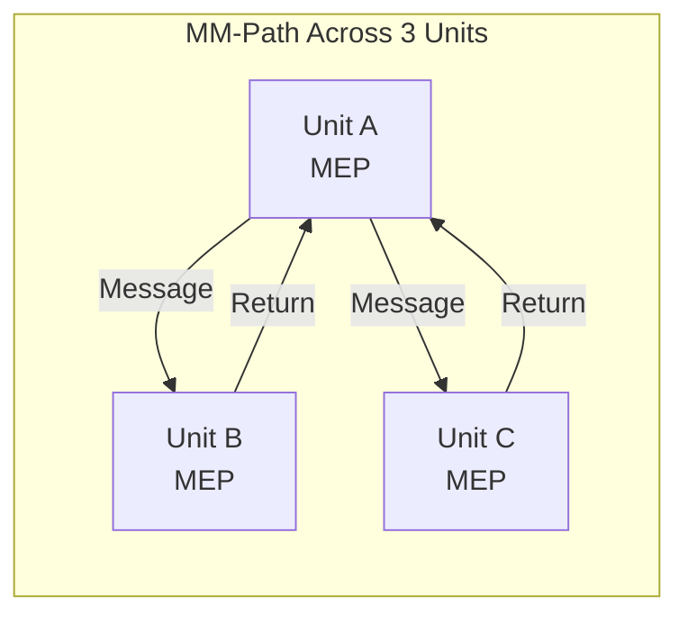

# Lecture 15 — Call Graph & Path-Based Integration

## 📌 Overview

This lecture continues [[Integration Testing]] by addressing the fundamental problem with [[Lecture 14 - Integration Testing|decomposition-based integration]] — **impossible test pairs**. The solution is to use the **[[Call Graph]]**, which reflects actual execution-time connections. This leads to **pairwise**, **neighborhood**, and **path-based** (MM-path) integration strategies.

---

## 1 · Drawback of Decomposition-Based Integration

The functional decomposition tree is derived from **lexicological inclusion** — the order in which units need to be compiled. This leads to **impossible test pairs** (e.g., Main ↔ isLeap in the Calendar program, even though Main never directly calls isLeap).

> [!important] The Solution: The Call Graph
> The call graph is developed by considering units to be **nodes**. If unit A calls (or uses) unit B, there is an **edge** from node A to node B. Edges refer to **actual execution-time connections**.

---

## 2 · Call Graph–Based Integration

### How It Works

Stubs and drivers are the same as in decomposition-based approaches, but based on the **call graph** rather than the decomposition tree. This preserves the **fault isolation** feature.

### Example: Calendar Program Call Graph

The call graph shows only **actual** caller-callee relationships:
- Main → getDate
- Main → nextDate
- Main → weekDay
- Main → zodiac
- Main → memorialDay
- Main → friday13th
- getDate → getDigits
- getDate → isValidDate
- isValidDate → lastDayOfMonth
- lastDayOfMonth → isLeap
- etc.

---

## 3 · Pairwise Integration

### Concept

The idea is to eliminate the **stub/driver development effort** by using actual code — testing one **pair of units** (an edge in the call graph) at a time.

One integration test session for **each edge** in the call graph.

### Example: Calendar

| Method | Number of Sessions |
|--------|-------------------|
| Top–down integration | 15 sessions (one per stub replacement) |
| **Pairwise integration** | **19 sessions** (one per edge) |

### Pros and Cons

| Aspect | Assessment |
|--------|------------|
| **Fault isolation** | High — if a test fails, the fault must be in one of the two units |
| **Stub/driver effort** | Reduced |
| **Drawback** | A fix that works in one pair may not work in another pair involving the same unit |

---

## 4 · Neighborhood Integration

### Concept

Borrowing the notion of a **neighbourhood** from topology:

> [!definition] Neighborhood (Radius 1)
> The set of nodes that are **one edge away** from the given node.

### How to Compute Number of Neighbourhoods

Using the **adjacency matrix**:
- **Interior node** = nonzero indegree & nonzero outdegree
- $\text{Neighbourhoods} = \text{interior nodes} + \text{source nodes}$
- $\text{Neighbourhoods} = \text{nodes} - \text{sink nodes}$

### Pros and Cons

| Aspect | Assessment |
|--------|------------|
| **Stub/driver effort** | Reduced |
| **Matches composition** | Works well with build-based development |
| **Fault isolation** | Reduced for large neighbourhoods |
| **Regret** | Fixing a node in one neighbourhood requires retesting all neighbourhoods containing it |

---

## 5 · Path-Based Integration

### Motivation

Structural integration (decomposition and call graph) assumes that units integrated with respect to structural information will exhibit **correct behaviour**. But we want **system-level threads of behaviour** to be correct. Path-based integration resolves this.

### New and Extended Concepts

#### Source Node (Redefined)
- A statement fragment at which program execution **begins or resumes**
- First executable statement in a unit is a source node
- Also occurs immediately after nodes that **transfer control** to other units

#### Sink Node (Redefined)
- A statement fragment at which program execution **terminates**
- The final executable statement
- Also statements that **transfer control** to other units

#### Module Execution Path (MEP)
A sequence of statements that begins with a **source node** and ends with a **sink node**, with no intervening sink nodes.

Program graphs now have **multiple source and sink nodes**.

#### Message
A programming language mechanism that lets one unit transfer control to another and receive a response.

#### MM-Path (Module–Message Path)

> [!definition] MM-Path
> An **interleaved sequence** of Module Execution Paths (MEPs) and messages — a sequence of MEPs that includes transfers of control among separate units.
>
> - In traditional software: "MM" = **Module–Message**
> - In OO software: "MM" = **Method–Message**

MM-paths **always represent feasible execution paths** — they cross unit boundaries.

#### MM-Path Graph
- **Nodes** are MEPs
- **Edges** correspond to messages and returns

#### Message Quiescence
Message **inactivity** — occurs when a unit that sends **no messages** is reached. This is a natural endpoint for an MM-path.

---

## 6 · MM-Path Complexity

Cyclomatic complexity can be computed for MM-paths, providing a measure of how thoroughly they need to be tested.

### Pros and Cons

| Aspect | Assessment |
|--------|------------|
| **Nature** | Hybrid of functional and structural testing |
| **Applicability** | Works for waterfall, composition-based, and OO development |
| **Advantage** | Closely coupled with actual system behaviour |
| **Cost** | More effort to identify MM-paths, but eliminates stub/driver development |

---

## 7 · Example: integrationNextDate

The Calendar program extended with NextDate:
- **Functional decomposition tree** — structural relationships
- **Call graph** — actual execution connections
- **MM-paths** — for a specific date (e.g., May 27, 2012)

### Recommendation

If MM-path integration seems too expensive for a particular case, take a **fallback position** and use **call graphs**.

### Comparison of Strategies

| Strategy | Basis | Fault Isolation | Stub/Driver Effort | Interface Reality |
|----------|-------|----------------|-------------------|-------------------|
| **Top–Down** | Decomposition tree | Good | High | May have impossible pairs |
| **Bottom–Up** | Decomposition tree | Good | High | May have impossible pairs |
| **Pairwise** | Call graph | High | Reduced | Real interfaces |
| **Neighborhood** | Call graph | Moderate | Reduced | Real interfaces |
| **MM-Path** | MEP + Messages | Good | None needed | Real behaviour |

---

## 8 · Key Takeaways

1. **Call graph–based** integration fixes the impossible test pair problem of decomposition-based approaches
2. **Pairwise integration** tests each edge in the call graph — high fault isolation
3. **Neighborhood integration** groups units by graph adjacency — reduces stub/driver effort
4. **Path-based integration** uses **MM-paths** — interleaved MEPs and messages that represent actual execution behaviour
5. **Message quiescence** provides natural endpoints for MM-paths
6. MM-paths are a **hybrid** of functional and structural testing — the closest to system-level behaviour

---

## 📚 References

- Jorgensen, P. C. (2014). *Software Testing and Analysis, A Craftsman's Approach*. CRC Press. **Chapter 13.**
- Ammann, P. & Offutt, J. (2008). *Introduction to Software Testing*. Cambridge University Press.
- Myers, G. J. (2012). *The Art of Software Testing*. John Wiley & Sons.
- Pezzè, M. & Young, M. (2008). *Software Testing and Analysis: Process, Principles, and Techniques*. Wiley.

---

← [[Lecture 14 - Integration Testing]] | [[Intro to Software Testing MOC]] | [[Lecture 16 - System Testing]] →
