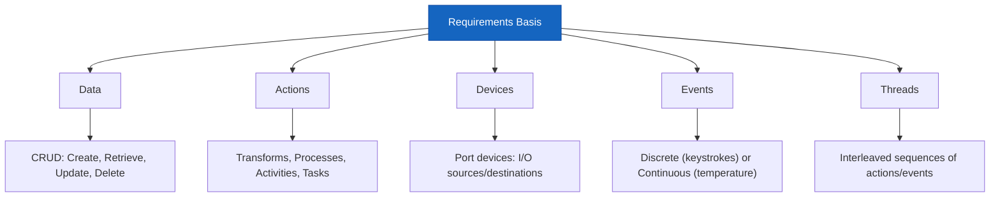

# Lecture 16 — System Testing

## 📌 Overview

**[[System Testing]]** is the level closest to everyday experience. Its objective is to **demonstrate correct behaviour** and find where it departs from expectations. It is usually performed **before a delivery deadline**.

---

## 1 · Fundamental Concepts

### Atomic System Function (ASF)

> [!definition] Atomic System Function (ASF)
> An **action that is observable at the system level** in terms of port input and output events. ASFs are based on the **thread concept**.

### Thread-Based System Testing

- Closely coupled with the **requirements specification**
- Uses the **symbiosis** between specification-based and code-based testing

### What Are Threads?

Threads are hard to define precisely — they can be viewed as:

| View | Description |
|------|-------------|
| A **scenario** of normal usage |
| A **system-level test case** |
| A **stimulus/response pair** |
| Behaviour from a sequence of system-level inputs |
| An interleaved sequence of **port input and output events** |
| A sequence of **transitions** in a state machine |
| A sequence of **MM-paths** |
| A sequence of **ASFs** |

---

## 2 · SATM Example (Simple ATM)

The SATM (Simple ATM) system is used as a running example for system testing.

### Candidate Threads

| Thread | Description |
|--------|-------------|
| **Entry of a digit** | Single keystroke processing |
| **PIN entry** | Sequence of digits + screen responses |
| **Simple transaction** | Card entry → PIN → transaction type → account → operation → report |

### PIN Thread Details

1. Screen requesting PIN digits
2. Interleaved digit keystrokes and screen responses
3. Customer **cancellation** before full PIN is entered
4. System disposition: **3 chances** to enter correct PIN
   - Correct PIN → transaction type screen
   - Incorrect PIN 3 times → card not returned, no access

---

## 3 · Thread Definitions

### ASF Graph

The **directed graph** in which:
- **Nodes** are ASFs
- **Edges** represent sequential flow

| Node Type | Description |
|-----------|-------------|
| **Source ASF** | Appears as a source node in the ASF graph (e.g., card entry) |
| **Sink ASF** | Appears as a sink node (e.g., session termination) |
| **Intermediary ASF** | Cannot be tested alone at the system level — needs predecessor ASFs |

### System Thread

A **path from a source ASF to a sink ASF** in the ASF graph of a system.

---

## 4 · Basis Concepts for Requirements Specification

Recall the notion of a **basis of a vector space** (from Lecture 12). Instead of anticipating all variations, system testing can use a **basis set** of requirements specification constructs:

### The Five Fundamental Constructs



### Data
- Entity/Relationship (E/R) models are the most common
- Often developed in terms of **CRUD** actions: Create, Retrieve, Update, Delete
- **Read-only** data (e.g., PIN) must be part of system initialization — an indicator of **source ASFs**

### Actions
- Actions have **inputs and outputs** (data or port events)
- Synonyms: Transform, Data transform, Control transform, Process, Activity, Task, Method, Service

### Devices (Ports)
- Sources and destinations of system-level inputs/outputs
- **Port** = the point at which an I/O device is attached
- **Physical actions** (keystrokes, screen emissions) occur on port devices
- In the absence of actual devices, **move the port boundary inward** (e.g., writing to PDF)

### Events
- Have characteristics of both **data** and **actions**
- Can be **discrete** (keystrokes) with time duration, or **continuous** (temperature, altitude, pressure)
- **Port input events** = physical-to-logical translations
- **Port output events** = logical-to-physical translations
- System testers focus on the **physical side**; integration testers focus on the **logical side**

### Threads
- The **least frequently used** of the five constructs
- Usually falls to the tester to find them in interactions among data, events, and actions
- Easy to find threads in **control models** — but models are not the reality of a system

### E/R Model of Relationships

```
Data ──┬──→ input/output of →── Action
Events ─┘           
Ports → events occur on ports
Actions → occur in threads
Threads → composed of actions
```

All relationships are **many-to-many** — this demonstrates the difficulty of system testing.

---

## 5 · Model-Based Threads

Finite state machine models show system testing threads efficiently:

- At the **high level**: states = stages of processing, transitions = abstract logical events
- In SATM: the **card entry** state would decompose into lower levels (jammed cards, upside-down cards, stuck rollers)

---

## 6 · Nonfunctional System Testing

### Definition

> [!definition] Nonfunctional Testing
> Refers to **how well** a system performs its functional requirements. Many nonfunctional requirements are categorized as "**-abilities**."

### Common -Abilities

| -Ability | Description |
|----------|-------------|
| **Reliability** | System operates without failure under stated conditions |
| **Maintainability** | Ease of making changes |
| **Scalability** | Ability to handle growth |
| **Usability** | Ease of use |
| **Compatibility** | Works with other systems |
| **Security** | Protection against threats |

---

## 7 · Stress Testing

### Definition

Also called **performance testing**, **capacity testing**, or **load testing** (though strictly, load testing considers an upper limit while stress tests **go beyond** the limit).

> [!important] One of the most important forms of nonfunctional testing (along with security testing).

### Strategies

| Strategy | Description |
|----------|-------------|
| **Compression** | Simulate many users with fewer test machines |
| **Replication** | Duplicate real-world conditions at scale |
| **Mathematical approaches** | Queuing theory, reliability models, simulation |

---

## 8 · Other Types of System Testing

Over **50 different types** of system testing exist, including:

| Type | Description |
|------|-------------|
| **Usability Testing** | How intuitive the system is |
| **Recovery Testing** | How well the system recovers from failures |
| **Migration Testing** | Data and functionality migration |
| **Hardware/Software Testing** | HW/SW integration |
| **Installation Testing** | Installation process |
| **Security Testing** | Vulnerability assessment |

### Difficulties

- Time/Budget constraints
- Communication (team, stakeholders, regulation)
- Time to market

### A Comparison: Unit vs. Integration vs. System Testing

| Aspect | Unit Testing | Integration Testing | System Testing |
|--------|-------------|-------------------|----------------|
| **Scope** | Single unit | Multiple units | Entire system |
| **Basis** | Detailed design | Architecture | Requirements |
| **Focus** | Internal logic | Interfaces | Behaviour |
| **Testers** | Developers | Developers/Testers | Testers/QA |

---

## 9 · Key Takeaways

1. **System testing** operates at the level closest to the user — demonstrating correct behaviour
2. **ASFs** are the building blocks — actions observable at the system level via port events
3. **Threads** are sequences of ASFs from source to sink — they are hard to define but essential
4. The **five basis constructs** for requirements are: Data, Actions, Devices, Events, Threads
5. **Nonfunctional testing** focuses on the "-abilities": reliability, security, scalability, etc.
6. **Stress testing** goes beyond normal limits — important for real-time and high-availability systems
7. Over **50 types** of system testing exist, but time/budget constraints force prioritisation

---

## 📚 References

- Jorgensen, P. C. (2014). *Software Testing and Analysis, A Craftsman's Approach*. CRC Press. **Chapter 14.**
- Ammann, P. & Offutt, J. (2008). *Introduction to Software Testing*. Cambridge University Press.
- Myers, G. J. (2012). *The Art of Software Testing*. John Wiley & Sons.
- Pezzè, M. & Young, M. (2008). *Software Testing and Analysis: Process, Principles, and Techniques*. Wiley.

---

← [[Lecture 15 - Call Graph and Path-Based Integration]] | [[Intro to Software Testing MOC]]
